# 摘　　要

　　随着信息技术的迅猛发展和数字化时代的到来，各类媒体资源呈爆炸式增长，传统媒体资源管理系统面临着扩展性差、功能单一和智能化程度低等问题。用户在海量媒体内容中难以快速找到感兴趣的资源，亟需智能化的媒体资源管理与推荐系统解决信息过载问题。

　　为解决上述问题，本文设计并实现了一个基于微服务架构的智能书影音管理与推荐系统。系统采用Spring Cloud构建微服务生态，实现了用户服务、书籍服务、音乐服务、视频服务等核心模块；基于Vue.js开发响应式前端界面，提供流畅直观的用户交互体验；集成讯飞星火大模型，实现书籍内容理解、歌词情感分析等智能功能；应用InsightFace技术，提供人脸识别登录；应用Whisper技术自动生成歌词和视频字幕，设计协同过滤和基于内容的混合推荐算法，实现个性化内容推荐。

　　本系统实现了个性化推荐，媒体内容智能管理，包括人脸识别、歌词生成、书籍概要、歌词情感分析等多种大模型的应用。测试结果表明，系统功能完整、性能稳定，能够有效解决媒体资源的存储、管理、分析和个性化推荐问题。本研究探索了微服务架构与人工智能技术在媒体资源管理领域的应用模式，为类似系统的开发提供了参考。

关键词：微服务架构；资源管理；语音识别；人脸识别；个性化推荐

ABSTRACT

　　With the rapid development of information technology and the advent of the digital age, all kinds of media resources are exploding, and traditional media resource management systems are facing problems such as poor scalability, single function and low intelligence. It is difficult for users to quickly find interesting resources in massive media content, and intelligent media resource management and recommender systems are urgently needed to solve the problem of information overload.

　　In order to solve the above problems, this paper designs and implements a smart book audio and video management and recommender system based on micro-service structure. The system uses Spring Cloud to build a micro-service ecosystem, realizing core modules such as user service, novel service, music service, and video service; develops a responsive front-end interface based on Vue.js to provide a smooth and intuitive user interaction experience; integrates iFLYTEK Spark model to realize intelligent functions such as novel content understanding and lyrics sentiment analysis; applies InsightFace technology to provide facial recognition login; applies Whisper technology to automatically generate lyrics and video subtitles, and designs collaborative filtering and content-based hybrid recommendation algorithms to realize personalized content recommendation.

　　The system realizes personalized recommendation and intelligent management of media content, including the application of facial recognition, lyrics generation, novel summary, lyrics sentiment analysis and other large models. The test results show that the system has complete functions and stable performance, and can effectively solve the problems of storage, management, analysis and personalized recommendation of media resources. This st

# 目　　录

[第1章　绪论 1](#_Toc198583493)

　　[1.1　研究背景和意义 1](#_Toc198583494)

　　[1.2　国内外研究现状 1](#_Toc198583495)

　　[1.3　研究内容和目标 2](#_Toc198583496)

　　[1.4　论文组织结构 2](#_Toc198583497)

　　[1.5　本章小结 3](#_Toc198583498)

[第2章　关键技术 4](#_Toc198583499)

　　[2.1　Spring Cloud 4](#_Toc198583500)

　　[2.2　Vue 4](#_Toc198583501)

　　[2.3　语音识别 4](#_Toc198583502)

　　[2.4　人脸识别 4](#_Toc198583503)

　　[2.5　推荐算法 5](#_Toc198583504)

　　[2.6　本章小结 5](#_Toc198583505)

[第3章　需求分析 6](#_Toc198583506)

　　[3.1　业务流程分析 6](#_Toc198583507)

　　　　[3.1.1　内容管理流程 6](#_Toc198583508)

　　　　[3.1.2　内容分析流程 6](#_Toc198583509)

　　　　[3.1.3　推荐流程 6](#_Toc198583510)

　　[3.2　功能需求分析 6](#_Toc198583511)

　　　　[3.2.1　内容管理 6](#_Toc198583512)

　　　　[3.2.2　内容分析 8](#_Toc198583513)

　　　　[3.2.3　资源生成 9](#_Toc198583514)

　　　　[3.2.4　人脸识别 10](#_Toc198583515)

　　　　[3.2.5　个性化推荐 10](#_Toc198583516)

　　[3.3　非功能需求分析 11](#_Toc198583517)

　　　　[3.3.1　性能需求 11](#_Toc198583518)

　　　　[3.3.2　安全性需求 11](#_Toc198583519)

　　　　[3.3.3　可扩展需求 11](#_Toc198583520)

　　[3.4　本章小结 11](#_Toc198583521)

[第4章　软件设计 12](#_Toc198583522)

　　[4.1　系统总体架构设计 12](#_Toc198583523)

　　　　[4.1.1　前端层 12](#_Toc198583524)

　　　　[4.1.2　网关层 12](#_Toc198583525)

　　　　[4.1.3　服务层 12](#_Toc198583526)

　　　　[4.1.4　数据层 13](#_Toc198583527)

　　[4.2　微服务模块划分与职责 13](#_Toc198583528)

　　　　[4.2.1　基础支撑服务 13](#_Toc198583529)

　　　　[4.2.2　核心业务服务 13](#_Toc198583530)

　　　　[4.2.3　智能分析服务 13](#_Toc198583531)

　　[4.3　数据库设计 13](#_Toc198583532)

　　　　[4.3.1　用户服务数据库设计 14](#_Toc198583533)

　　　　[4.3.2　书籍服务数据库设计 14](#_Toc198583534)

　　　　[4.3.3　音乐服务数据库设计 15](#_Toc198583535)

　　　　[4.3.4　视频服务数据库设计 17](#_Toc198583536)

　　　　[4.3.5　文档服务数据库设计 20](#_Toc198583537)

　　[4.4 API接口设计 21](#_Toc198583538)

　　　　[4.4.1　用户服务API 21](#_Toc198583539)

　　　　[4.4.2　书籍服务API 22](#_Toc198583540)

　　　　[4.4.3　音乐服务API 23](#_Toc198583541)

　　　　[4.4.4　视频服务API 24](#_Toc198583542)

　　　　[4.4.5　文档服务API 24](#_Toc198583543)

　　　　[4.4.6　星火大模型服务API 25](#_Toc198583544)

　　　　[4.4.7　Python后端服务API 25](#_Toc198583545)

　　[4.5　本章小结 26](#_Toc198583546)

[第5章　软件开发 27](#_Toc198583547)

　　[5.1　用户认证与授权模块实现 27](#_Toc198583548)

　　　　[5.1.1　认证授权架构设计 27](#_Toc198583549)

　　　　[5.1.2　人脸识别登录实现 27](#_Toc198583550)

　　[5.2　书籍管理与推荐模块实现 28](#_Toc198583551)

　　　　[5.2.1　书籍管理功能实现 28](#_Toc198583552)

　　　　[5.2.2　书籍推荐系统实现 30](#_Toc198583553)

　　　　[5.2.3　书籍在线阅读器实现 30](#_Toc198583554)

　　[5.3　音乐管理与推荐模块实现 31](#_Toc198583555)

　　　　[5.3.1　音乐管理功能实现 31](#_Toc198583556)

　　　　[5.3.2　音乐推荐算法实现 32](#_Toc198583557)

　　　　[5.3.3　音乐在线播放器实现 33](#_Toc198583558)

　　[5.4　视频管理与推荐模块实现 34](#_Toc198583559)

　　　　[5.4.1　视频管理功能实现 34](#_Toc198583560)

　　　　[5.4.2　视频推荐算法实现 35](#_Toc198583561)

　　　　[5.4.3　视频在线播放实现 35](#_Toc198583562)

　　[5.5　文档管理与在线阅读模块实现 36](#_Toc198583563)

　　　　[5.5.1　文档管理功能实现 36](#_Toc198583564)

　　　　[5.5.2　文档版本控制实现 36](#_Toc198583565)

　　　　[5.5.3　在线预览与阅读功能实现 37](#_Toc198583566)

　　[5.6　本章小结 37](#_Toc198583567)

[第6章　软件测试 38](#_Toc198583568)

　　[6.1　测试环境与策略 38](#_Toc198583569)

　　　　[6.1.1　测试环境配置 38](#_Toc198583570)

　　　　[6.1.2　测试策略 38](#_Toc198583571)

　　[6.2　功能测试 38](#_Toc198583572)

　　　　[6.2.1　个性化推荐功能测试 38](#_Toc198583573)

　　　　[6.2.2　内容管理功能测试 39](#_Toc198583574)

　　　　[6.2.3　大模型集成测试 40](#_Toc198583575)

　　　　[6.2.4　用户服务功能测试 41](#_Toc198583576)

　　[6.3　性能测试 41](#_Toc198583577)

　　　　[6.3.1　负载测试 41](#_Toc198583578)

　　　　[6.3.2　接口响应时间测试 42](#_Toc198583579)

　　[6.4　测试结果分析 42](#_Toc198583580)

　　　　[6.4.1　功能完整性分析 42](#_Toc198583581)

　　　　[6.4.2　性能指标分析 42](#_Toc198583582)

　　　　[6.4.3　测试结论 43](#_Toc198583583)

　　[6.5　本章小结 43](#_Toc198583584)

[第7章　总结与展望 44](#_Toc198583585)

　　[7.1　工作总结 44](#_Toc198583586)

　　[7.2　系统创新点 44](#_Toc198583587)

　　[7.3　不足与展望 45](#_Toc198583588)

　　　　[7.3.1　系统不足 45](#_Toc198583589)

　　　　[7.3.2　未来展望 45](#_Toc198583590)

[结　　论 46](#_Toc198583591)

[参考文献 47](#_Toc198583592)

[致　　谢 48](#_Toc198583593)

# 第1章　绪论

## 1.1　研究背景和意义

随着信息技术的迅猛发展和数字化时代的到来，各类媒体资源（如文本、音频、视频等）呈爆炸式增长。面对海量媒体内容，用户往往难以快速找到感兴趣的资源，个性化推荐算法因此成为解决信息过载问题的关键技术。传统的单体架构应用在处理海量多媒体资源和复杂推荐算法时面临着系统耦合度高、可扩展性差、维护困难等问题。与此同时，人工智能技术的快速发展为媒体资源的深度分析、智能处理和精准推荐提供了新的可能。在这一背景下，基于微服务架构构建的媒体资源管理与推荐系统应运而生，它能够有效解决媒体资源的存储、管理、分析和个性化推荐等问题，具有重要的研究意义。

本研究的主要意义体现在以下几个方面：采用微服务架构替代传统单体应用，实现系统的高内聚、低耦合，提高系统的可扩展性、可维护性和容错性。将书籍、音乐、视频等多种媒体资源进行统一管理，为用户提供一站式的媒体资源获取平台。将讯飞星火大模型、人脸识别等AI技术应用于媒体资源分析，实现内容理解、情感分析和个性化推荐。通过前后端分离架构和响应式设计，提供流畅、直观的用户界面，增强用户交互体验。融合协同过滤、基于内容推荐等多种算法，解决媒体资源信息过载问题，为用户提供精准、多样的书影音推荐服务，提升用户满意度和平台黏性。

## 1.2　国内外研究现状

微服务架构近年来在软件工程与企业应用领域持续受到关注，自Martin Fowler和James Lewis提出以来，微服务作为一种面向服务解耦、按业务域划分、支持独立部署的架构风格，已逐渐取代传统单体应用，成为构建大型分布式系统的主流模式\[1\]\[2\]。在国际上，Netflix最早系统性实现微服务架构，构建了完整的服务发现、断路器、配置中心和API网关体系，极大地提升了服务的可扩展性与容错性。Amazon和Spotify也在持续推进微服务、容器化与DevOps工具链集成，推动CI/CD流程自动化。而在国内，阿里巴巴通过Dubbo、Nacos、Sentinel等技术逐步建立起自主可控的微服务体系，腾讯推出了TARS框架，在高并发服务治理中获得良好应用，字节跳动则在视频、资讯和推荐系统中广泛使用Spring Cloud与Kubernetes，实现了跨地域、高可用的服务调度\[3\]。学术界也对微服务在性能隔离、分布式事务、服务依赖追踪等方面展开研究，试图提升其在复杂场景下的稳定性与运维效率\[4\]。

在媒体资源管理方面，国外如YouTube、Spotify和Netflix已实现从传统单体式的内容管理系统向基于云原生与微服务的多媒体管理平台演进。这些平台在视频、音频、图文等资源的统一建模、结构化存储与分布式检索方面积累了丰富经验，特别是在媒体元数据标签体系构建、多语言字幕与内容摘要自动生成上形成了成熟技术链。而国内如腾讯视频、爱奇艺、喜马拉雅等平台虽然在各自垂直领域建立起分布式内容分发与播放体系，但多数平台在资源统一建模、多模态融合以及跨系统推荐方面仍存在技术断层。目前，国内学术界正尝试利用知识图谱、情感计算与图卷积网络等新方法，探索统一化、多维度的媒体资源管理路径\[5\]\[6\]，但真正能整合书籍、音频与视频等多类媒体资源，并实现智能处理与推荐的综合平台仍较为稀缺。

个性化推荐技术作为连接用户与内容的桥梁，长期是信息系统与人工智能研究的重要方向。推荐系统的发展经历了从协同过滤到内容推荐，再到深度学习推荐模型的阶段性演进。国际上，Netflix推出了基于神经协同过滤（NCF）的推荐算法，用以捕捉用户与项目之间的复杂非线性关系\[7\]；Google利用深度学习在YouTube推荐系统中大规模部署多塔结构与注意力机制，以提升短期兴趣建模的精度；Amazon在上下文感知与商品图谱建模方面持续优化，形成以行为嵌入、序列建模为核心的商品推荐引擎。国内研究紧跟国际趋势，阿里巴巴的“猜你喜欢”引擎引入深度兴趣网络（DIN）与强化学习，字节跳动则结合图神经网络（GNN）与多任务学习优化兴趣漂移建模与用户召回策略。相关研究成果表明，多模态特征融合\[8\]\[9\]（图像、文本、音频等）以及基于用户情绪和上下文变化的动态推荐成为目前推荐系统研究的主要趋势\[10\]\[11\]。

人工智能技术在媒体内容分析与智能推荐中的深度融合也引起广泛关注。OpenAI的GPT系列模型\[12\]和Google推出的Gemini模型将多模态处理能力推向新的高度，使得图文、音视频内容的跨模态理解成为可能。国内的科大讯飞、百度等在语音识别、情感识别与知识标注方面取得突破，讯飞星火认知大模型通过多轮对话与上下文感知，为媒体内容的理解和推荐提供了强大支持\[13\]。此外，ArcFace、FaceNet等深度人脸识别算法的普及\[14\]，也使用户生物特征与推荐策略之间的关联成为新的研究热点。在国内高校与研究机构中，面向书籍推荐的用户画像建模、情绪化音乐推荐、时间上下文感知建模等方向持续发展，代表了媒体资源推荐的进一步细分与智能化\[15\]\[16\]。

综合来看，当前国内外在微服务架构、媒体资源统一管理、个性化推荐以及AI驱动的内容理解等方面均取得了阶段性成果，但能够实现多模态内容统一整合、智能分析、个性推荐与高性能微服务架构融合的综合性平台仍较为稀缺，特别是在融合大模型推理、用户行为预测与实时反馈优化的智能书影音推荐系统方面，尚处于探索与创新阶段，未来研究潜力巨大。

## 1.3　研究内容和目标

本研究旨在设计并实现一个基于微服务架构的媒体资源管理与推荐系统，围绕系统架构、媒体资源处理、推荐算法、人工智能应用与前端设计等方面展开。系统将采用Spring Cloud框架构建完整的微服务生态，涵盖服务注册与发现、配置管理、API网关和负载均衡等核心模块，并设计微服务间的通信机制及数据一致性方案。在功能模块方面，将实现书籍、音乐、视频等多媒体资源的上传、播放、分析与推荐功能，构建统一的书影音管理体系。推荐系统方面，将融合协同过滤、内容推荐和混合策略，支持实时推荐与冷启动处理，提升推荐效果的准确性与多样性。人工智能部分将引入讯飞星火大模型进行书籍内容的摘要与情感提取，运用自然语言处理技术分析歌词情感，并集成人脸识别用于用户身份验证与个性化服务，同时结合Whisper模型实现自动化歌词生成与分析。前端界面采用Vue框架进行响应式设计，注重交互体验与资源展示效果。研究目标是构建一个功能完备、性能稳定、具备良好扩展性的媒体资源管理平台，探索微服务架构与人工智能技术在媒体资源管理与个性化推荐中的融合应用与实践路径。

## 1.4　论文组织结构

本论文共分为七章，组织结构如下：

第1章绪论：介绍研究背景及意义、国内外研究现状、研究内容与目标以及论文的组织结构。

第2章关键技术：详细介绍系统开发所涉及的关键技术，包括Spring Cloud、Vue、音频识别、人脸识别以及推荐算法等。

第3章需求分析：梳理核心业务，从需求和非功能需求两个方面分析系统需求。

第4章软件设计：阐述系统总体架构设计，详细说明微服务模块划分与职责，展示数据库设计、API接口设计以及安全设计方案。

第5章软件开发：重点介绍系统核心功能的实现细节，包括用户认证与授权、书籍管理与推荐、音乐管理与推荐、视频管理与推荐、讯飞星火大模型集成以及人脸识别技术应用等。

第6章软件测试：介绍系统测试的环境与策略，包括功能测试、性能测试等内容，分析测试结果。

第7章总结与展望：总结本研究的主要工作和创新点，分析系统存在的不足，提出未来的改进方向和展望。

## 1.5　本章小结

本章首先介绍智能书影音管理与推荐系统的研究背景和意义，指出传统媒体资源管理系统存在扩展性不足、功能单一和智能化水平较低等问题，说明微服务架构和人工智能技术在解决这些问题中的关键作用。随后，通过分析国内外研究现状，总结了微服务架构、媒体资源管理、个性化推荐算法和人工智能应用的发展情况，为本研究提供理论支持和参考。接着，明确本研究的主要内容和目标，包括微服务架构设计、书影音资源管理、个性化推荐算法、人工智能分析技术应用以及前端界面设计与实现等五个方面。本章为后续研究内容奠定了基础，明确了研究方向和目标。

# 第2章　关键技术

## 2.1　Spring Cloud

Spring Cloud是一个基于Spring Boot的分布式系统开发框架，提供了丰富的微服务开发工具，可以简化分布式系统的构建与运维。比如，Eureka可以实现书籍、音乐、视频等微服务的注册与发现，确保服务实例的统一管理和动态访问。Gateway作为系统的统一API 网关，用来处理所有客户端请求，支持路由转发、安全过滤和负载均衡。Config提供配置信息的集中管理和动态更新。OpenFeign可在服务间进行接口调用。此外，系统结合Spring Security和JWT实现用户认证与权限控制。这些组件协同工作，构建了高可用、可扩展且安全的微服务架构，为系统的稳定运行提供支撑。

## 2.2　Vue

Vue是一个渐进式JavaScript框架，以简单易用和灵活性著称，广泛应用于现代前端开发。本系统以Vue.js为核心前端框架，利用其响应式数据绑定和组件化开发特性，支持动态界面更新。界面拆分为书籍卡片、音乐播放器、视频播放器等可复用组件，提升代码模块化和维护性。Vue Router提供单页应用的页面导航和路由控制，确保流畅的用户体验。Pinia 用于管理用户登录信息、播放列表等全局状态，优化组件间数据通信。Axios负责前后端数据交互。UI方面，后台采用Element Plus打造统一美观的界面风格，集成Echarts显示媒体资源使用情况和用户行为分析图表。前台使用拟物化风格，设计美观界面，提升用户体验。

## 2.3　语音识别

Whisper是由OpenAI开发的一种自动语音识别模型，专注于将语音音频转换为文本，并支持多语言语音识别和翻译。其基于Transformer的编码器-解码器架构，能够高效处理多样化的音频输入。Whisper将输入音频分割为30秒片段，转换为对数梅尔频谱图，由编码器提取特征后，解码器生成对应的文本序列。在本系统中，Whisper作为核心音频处理模块，利用其高精度的语音识别和精准的时间戳标注功能，支持歌词文本与音频时间轴的匹配，生成准确的歌词时间序列。其抗噪能力和多语言支持确保了在复杂音频环境下的稳定表现。Whisper的开源特性还允许开发者根据需求进行微调，进一步优化特定场景的性能。

## 2.4　人脸识别

InsightFace是一个开源的深度人脸分析工具库，主要基于PyTorch和MXNet开发，专注于人脸识别、检测和对齐等任务。InsightFace集成了多种先进算法，包括人脸检测、人脸识别和人脸对齐。核心算法ArcFace使用加性角度间隔损失函数，通过优化特征嵌入的区分性，在Labeled Faces in the Wild (LFW) 数据集上达到99.83%的识别精度。人脸检测模块支持高效、鲁棒的检测，适应近距离、遮挡或复杂背景等场景。人脸对齐模块提供2D和3D关键点检测，用于精确的人脸几何分析。在本系统中，InsightFace提供人脸识别功能，通过 ArcFace 算法提取高区分度的特征嵌入，支持用户身份验证等功能。其高效的检测和对齐能力确保了在不同光线、角度和背景下的稳定表现。

## 2.5　推荐算法

推荐算法是用于从大量数据中筛选并向用户提供个性化内容或项目的算法，广泛应用于媒体资源管理、电子商务和社交平台等领域。基于内容的推荐是通过提取媒体内容的特征（如书籍题材、音乐风格或视频类型）构建特征向量并计算内容相似度，该方法不依赖用户交互数据，能有效解决冷启动问题。协同过滤算法则利用用户群体智慧，包括基于用户的协同过滤（通过相似用户群体推荐）和基于项目的协同过滤（通过项目相似度推荐），以及矩阵分解技术（如SVD）挖掘潜在特征。混合推荐系统则可以通过加权混合、切换策略或级联混合等方式整合多种算法优势。通过融合时间信息或基于时间上下文的语义分析，结合Flink实时处理技术动态感知用户兴趣变化；采用过滤冗余相似性信息的方法提升推荐多样性\[11\]；深度学习技术也可以挖掘用户行为与内容的深层关系，既可以提升推荐精准度又可以缓解冷启动问题。

## 2.6　本章小结

本章系统地介绍了智能书影音管理与推荐系统实现所依赖的关键技术。首先，详细阐述了微服务架构的主要特征和优势，为系统的整体架构设计提供了理论基础。其次，介绍了Spring Cloud微服务框架的核心组件及其功能，包括Eureka、Gateway、Config、OpenFeign等，这些组件共同构建了系统的微服务基础架构。随后，介绍了Vue前端框架的特性及其在系统中的应用，包括响应式数据绑定、组件化开发、Vue Router、Pinia等技术。接着，分别阐述了音频识别技术和人脸识别技术的原理与应用场景，这些技术为系统提供了智能分析和增值服务的能力。最后，介绍了推荐算法的核心原理，包括基于内容的推荐、协同过滤和混合推荐策略。

# 第3章　需求分析

## 3.1　业务流程分析

### 3.1.1　内容管理流程

用户可以通过分类导航、关键词搜索等多种方式查找感兴趣的书影音资源，系统会根据用户的搜索条件匹配相关资源，查找到后可以直接进入阅读或播放界面消费内容。同时用户也可以查看资源详情、收藏、评论，编辑收藏列表，管理员也可以修改资源元数据。

### 3.1.2　内容分析流程

用户在查看书籍章节或音乐歌词时，可以启动内容分析功能。系统将文本内容发送至讯飞星火大模型服务，由大模型进行专业化分析，并返回结构化的分析结果。分析结果包括书籍摘要、人物关系或歌词情感等内容，分析结果会被缓存以提高后续访问速度。

### 3.1.3　推荐流程

系统通过分析用户历史行为及上下文信息，结合基于内容的推荐、协同过滤算法和混合推荐算法，为用户生成个性化推荐。基于内容的推荐通过提取内容特征并计算相似度，适用于冷启动场景；协同过滤包括基于用户和基于项目的推荐，结合矩阵分解技术挖掘潜在特征，提升推荐精准度；再通过混合推荐算法则整合两者的优势，通过加权融合优化推荐效果，进一步提升准确性和覆盖率。

## 3.2　功能需求分析

### 3.2.1　内容管理

在书籍管理模块，管理员可以管理书籍元数据、智能章节划分，用户可以在线阅读、收藏和评分以及获取书籍推荐。书籍管理模块用例图如图3.1所示。

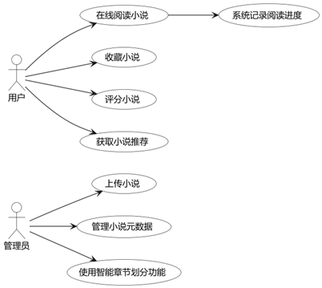

###### 图3.1　书籍管理用例图

在音乐模块，管理员可以上传音乐、管理音乐元数据，借助Whisper生成歌词，管理歌词。用户可以在线播放、创建和管理歌单、收藏评分音乐以及获取音乐推荐。系统支持歌词同步显示等特色功能。音乐管理用例图如图3.2所示。

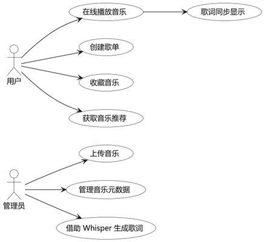

###### 图3.2　音乐管理用例图

在视频模块，管理员可以上传视频、管理视频元数据，用户则可以在线播放、记录观看进度、收藏、评分和获取推荐等功能。视频管理用例图如图3.3所示。

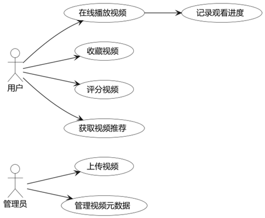

###### 图3.3　视频管理用例图

在文档管理模块，用户可以进行文档上传、文件夹结构管理、版本控制和在线文档预览等操作。文档上传功能包含了元数据管理作为其必要组成部分，确保文档被正确分类和描述。管理员除了拥有用户的权限外，还负责元数据管理。文档管理用例图如图3.4所示。

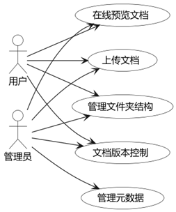

###### 图3.4　文档管理用例图

### 3.2.2　内容分析

在书籍内容分析模块，集成讯飞星火大模型，实现对书籍内容的分析，自动生成书籍摘要、人物关系识别与分析等核心功能，并引入分析结果缓存机制，有效提升响应速度与资源利用效率。当用户在阅读书籍时，可以选择特定章节并点击“内容分析”按钮，触发分析流程，系统首先会检查Redis缓存中是否已存在该章节的分析结果，如果缓存命中，则直接返回缓存结果，大大提高响应速度；如果缓存未命中，则系统会获取章节文本内容，并将其发送至大模型服务。书籍内容分析时序如图3.5所示。

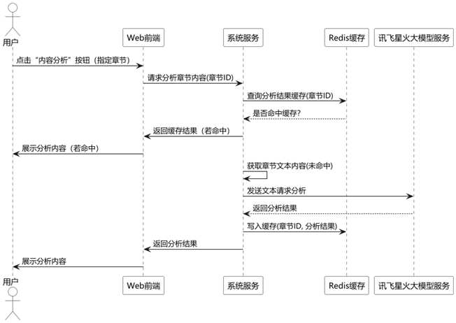

###### 图3.5　书籍内容分析时序图

在歌词情感分析模块，基于大模型实现歌词内容的深度理解与情感分析，支持从情感基调、主题意象、修辞技巧、深层含义和艺术价值等多维度解读歌词内容，结合歌词与音乐风格匹配分析，评估其与旋律的契合度，并通过情感可视化方式直观展示歌词的情感特征。用户在播放音乐并查看歌词时，可以点击"歌词分析"按钮，触发分析流程。系统首先检查Redis缓存中是否已存在该歌曲的分析结果，如果缓存命中，则直接返回缓存结果；如果缓存未命中，则系统获取完整歌词文本，并将其发送至星火大模型服务。歌词情感分析时序如图3.6所示。

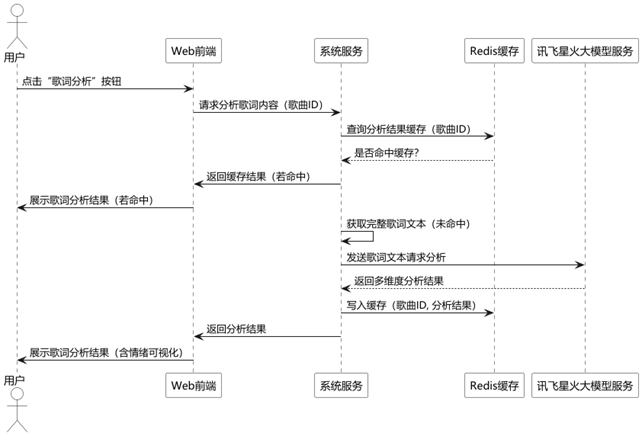

###### 图3.6　歌词情感分析时序图

### 3.2.3　资源生成

在歌词生成模块，基于OpenAI Whisper语音识别模型，实现音频中语音内容的自动转写与歌词生成，支持自动时间戳标注以实现歌词与音频的同步播放，并提供识别结果的编辑与优化接口。该功能主要由管理员使用，管理员上传音乐文件，然后请求系统自动生成歌词。音乐服务接收请求后，将音频文件发送至Python服务，后者加载OpenAI Whisper模型进行处理。歌词识别时序图如图3.7所示。

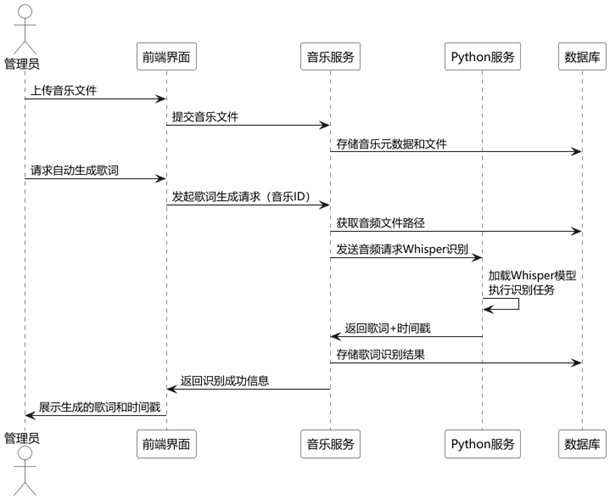

###### 图3.7　歌词识别时序图

在书籍章节自动划分模块，通过正则表达式识别多种常见章节格式（如“第X章”、“Chapter X”、“卷一 第X章”等），将整本书籍智能划分为结构化的章节单元。系统自动生成每章的编号、标题、字数与内容存储路径等元数据，并将正文内容上传至对象存储，仅保留元信息至数据库，提升系统性能与管理效率。支持异常处理与人工校正，适配多样化排版格式。章节划分时序图如图3.8所示。

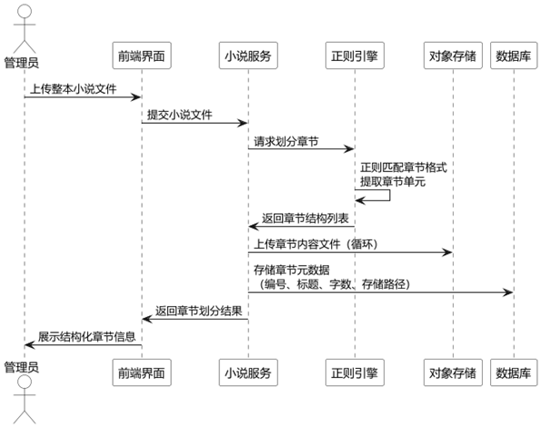

###### 图3.8　章节划分时序图

### 3.2.4　人脸识别

人脸识别基于 InsightFace 实现人脸识别身份验证，具备高精度的人脸特征提取与比对能力。系统提供人脸信息的注册、更新与管理功能。人脸识别登录流程首先由用户在前端界面触发，系统激活设备摄像头并显示预览画面，用户确认后拍照，前端捕获人脸图像并将其发送至认证服务。认证服务将图像转发至Python人脸服务，后者进行人脸检测和特征提取，然后在人脸特征库中查询匹配的特征向量，匹配到之后将对应用户名返回给认证服务，认证服务生成JWT返回前端，完成登录。人脸登录时序图如图3.9所示。

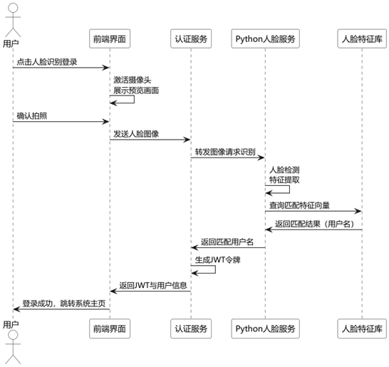

###### 图3.9　人脸登录时序图

### 3.2.5　个性化推荐

在个性化推荐模块，用户可以获取基于协同过滤的推荐、基于内容的推荐，以及新用户可以通过冷启动处理获取初始推荐。系统负责执行用户行为分析、实时行为跟踪和动态调整推荐内容。用户行为分析包括收集用户的浏览、收藏、评分和观看/阅读数据，这些数据用于支持协同过滤和基于内容的推荐算法。实时行为跟踪则促使系统动态调整推荐内容，从而提供更加个性化的用户体验。个性化推荐时序图如3.10所示。

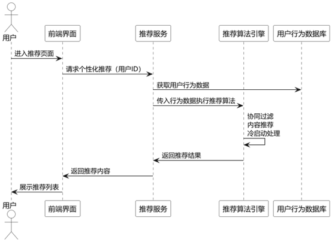

###### 图3.10　个性化推荐时序图

## 3.3　非功能需求分析

### 3.3.1　性能需求

在性能方面要求较高，确保普通操作页面的响应时间控制在2秒以内，保障用户体验的流畅性。具备良好的并发处理能力，能够支持至少1000个用户的同时请求，保证高并发场景下的稳定运行。针对媒体资源的加载优化，视频和音频等内容的缓冲时间不超过3秒，提升多媒体播放的即时性。同时，系统的吞吐量达到每秒处理至少500个事务，确保业务处理的高效和可靠。

### 3.3.2　安全性需求

采用可靠的身份认证机制，有效防止未授权访问；基于角色的访问控制（RBAC）确保用户仅能访问其被授权的资源。敏感数据如密码将进行加密存储，保障数据安全。同时，系统具备防范SQL注入等常见网络攻击的能力。关键操作均被详细记录，便于后续的安全审计和追踪。

### 3.3.3　可扩展需求

系统支持水平扩展，通过增加服务器节点实现灵活的容量扩展；功能设计具备良好的扩展性，能够在不影响现有功能的前提下方便地添加新功能；存储系统能够灵活扩展，以满足不断增长的数据存储需求。

## 3.4　本章小结

本章首先进行了业务流程分析，通过图表直观展示了媒体资源浏览与搜索、内容分析、管理员资源管理和推荐系统四个核心业务流程，清晰描述了各流程的操作路径和逻辑。通过需求分析，确定了系统应满足的功能和性能目标。之后，从功能需求角度出发，系统划分为用户管理、书籍管理、音乐管理、视频管理、内容推荐、用户交互和系统管理七大功能模块，明确了各模块的具体功能点。其次，从非功能需求角度分析了系统在性能、可靠性、安全性、可扩展性、可维护性和可用性等方面的要求，确保系统不仅功能完善，还具备良好的质量属性。

# 第4章　软件设计

## 4.1　系统总体架构设计

本系统采用基于微服务的分布式架构，遵循“前后端分离”的设计理念，整体架构分为四层：前端层、网关层、业务层与数据层，系统架构图如图4.1所示。

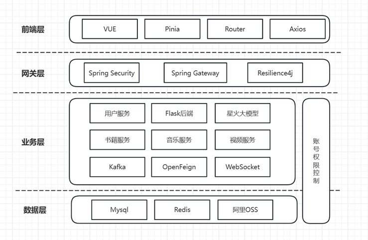

###### 图4.1　系统架构图

### 4.1.1　前端层

本系统前端采用 Vue.js 框架进行开发，结合 Vue Router 实现单页应用路由控制，Pinia 管理全局状态，Axios 负责与后端通信。之所以选择 Vue，是因其语法简洁、学习曲线平缓、社区生态活跃，适合快速构建可维护的中大型系统前端。同时，Pinia 作为官方推荐的状态管理工具，更契合组合式 API 的开发模式，Axios 也便于统一处理鉴权与异常。响应式布局保证了系统在多端设备上的良好适配，满足现代用户体验要求。

### 4.1.2　网关层

系统网关层基于 Spring Cloud Gateway 实现，承担统一请求入口、路由转发、安全控制和流量治理等职责。相比于传统的 Zuul 网关，Gateway 性能更优，支持响应式编程与灵活的过滤器链机制。通过整合 Spring Security 与 JWT，实现了分布式环境下的无状态认证授权；借助 Ribbon 实现服务间负载均衡，有效提升高并发场景下的可用性；引入 Resilience4j 进行限流与熔断控制，增强系统容错能力。该设计方案综合考虑了安全性、性能和可维护性。

### 4.1.3　服务层

服务层采用 Spring Boot + Spring Cloud 构建微服务集群，按业务功能划分为基础服务、业务服务、AI服务与辅助服务，各模块独立部署、解耦运行。微服务架构提升了系统的灵活性和可扩展性，便于后续维护与功能扩展；服务间通信使用 RESTful API 和 Feign 简化调用流程，同时引入 Kafka 处理异步任务，提升系统响应效率和并发能力。AI相关任务独立部署，有助于隔离高计算开销，保障主业务服务的稳定运行，整体设计兼顾了复杂性管理与性能优化。

### 4.1.4　数据层

数据层采用多种存储方式协同工作：结构化数据由 MySQL 管理，支持复杂关系建模与事务控制；高频访问的数据如登录状态、推荐缓存等交由 Redis 处理，以提升读写性能；海量媒体文件统一存储于阿里云 OSS，保证数据的高可用与可扩展。通过“冷热分离”策略优化了系统响应速度和资源使用效率，同时为系统未来的扩展和大数据分析打下基础。微服务间通过 REST 接口或消息队列通信，确保模块间松耦合，增强了系统的灵活性与可维护性。

## 4.2　微服务模块划分与职责

### 4.2.1　基础支撑服务

服务发现采用基于Eureka的机制，实现微服务实例的注册、发现、健康检查及负载均衡，确保服务间的高效可靠通信。配置中心基于Spring Cloud Config，提供集中化的配置管理，支持多环境配置文件的动态刷新。API网关采用Spring Cloud Gateway，作为系统统一入口，负责跨域请求处理、路由转发、负载均衡、权限控制和限流熔断。认证授权服务则依托Spring Security和JWT技术，完成用户身份认证、权限验证、Token管理和密码加密。

### 4.2.2　核心业务服务

核心业务服务以内容类型为划分维度，构建了书籍、音乐、视频、文档四大功能服务。各服务均基于领域驱动设计（DDD）理念进行拆分，具备独立的数据库和业务逻辑，降低耦合。书籍服务负责文本资源的管理和在线阅读，涵盖上传、分类等功能；音乐服务聚焦于音频内容的上传、歌词解析与播放；视频服务提供多格式视频内容上传、转码、播放；文档服务支持版本控制、在线预览与格式转换。所有业务服务统一通过阿里云 OSS 存储大文件，保障资源的安全与访问效率。

### 4.2.3　智能分析服务

星火大模型服务集成了讯飞星火大模型，主要提供自然语言处理与内容分析功能，包括书籍摘要总结、歌词情感分析。该服务利用Kafka实现异步处理，通过Redis缓存分析结果，并借助OpenFeign调用相关内容服务，确保高效稳定的智能分析能力。

Python接口服务则作为Java微服务与Python AI模块之间的桥梁，提供轻量级的RESTful API接口，支持跨语言通信，负责调用Python脚本执行人脸识别、歌词分析等AI任务，并将结果返回给Java微服务，实现了AI模型的无缝集成与协同运作。

## 4.3　数据库设计

数据库设计遵循了微服务架构下的数据隔离原则，每个服务管理自己的数据库，通过服务间API调用获取其他服务的数据。同时，针对查询频繁的数据，利用Redis进行缓存优化，提高系统响应速度。

### 4.3.1　用户服务数据库设计

用户服务主要管理用户基本信息和权限信息。用户表设计了完善的用户信息存储结构，包括基本信息、认证信息、状态管理。如表4.1所示：

##### 表4.1　用户表(user)设计

|              |               |                        |
| ------------ | ------------- | ---------------------- |
| 字段名       | 数据类型      | 描述                   |
| userId       | String        | 用户ID，主键           |
| userName     | String        | 用户名                 |
| nickName     | String        | 昵称                   |
| password     | String        | 密码                   |
| email        | String        | 电子邮箱               |
| birthday     | Date          | 出生日期               |
| sex          | String        | 性别                   |
| role         | String        | 角色，默认"user"       |
| introduction | String        | 个人介绍               |
| avatar       | String        | 头像URL                |
| status       | String        | 用户状态，默认"active" |
| createdAt    | LocalDateTime | 创建时间               |
| updatedAt    | LocalDateTime | 更新时间               |

### 4.3.2　书籍服务数据库设计

书籍服务主要管理书籍资源和用户交互数据，包含书籍表、书籍章节表、书籍收藏表等多张表。书籍表存储了书籍的基本信息，其中bookImg字段存储封面图片的OSS访问URL，避免数据库存储大型二进制文件。如表4.2所示：

##### 表4.2　书籍表(book)设计

|              |               |                    |
| ------------ | ------------- | ------------------ |
| 字段名       | 数据类型      | 描述               |
| id           | Integer       | 书籍ID，主键，自增 |
| typeId       | Integer       | 书籍类型ID         |
| bookName     | String        | 书籍名称           |
| bookAuthor   | String        | 作者               |
| bookImg      | String        | 封面图片URL        |
| bookDetails  | String        | 书籍简介           |
| chapterCount | Integer       | 章节总数           |
| createTime   | LocalDateTime | 创建时间           |
| updateTime   | LocalDateTime | 更新时间           |

书籍章节表通过bookId与书籍表关联，contentPath字段存储章节内容在OSS中的路径，而不是直接存储内容文本，优化了数据库性能。如表4.3所示：

##### 表4.3　书籍章节表(book_chapter)设计

|               |               |                    |
| ------------- | ------------- | ------------------ |
| 字段名        | 数据类型      | 描述               |
| id            | Integer       | 章节ID，主键，自增 |
| bookId        | Integer       | 书籍ID             |
| chapterNumber | Integer       | 章节编号           |
| chapterTitle  | String        | 章节标题           |
| contentPath   | String        | 内容存储路径       |
| wordCount     | Integer       | 字数统计           |
| createTime    | LocalDateTime | 创建时间           |

书籍收藏表记录了用户的收藏信息和阅读进度，通过userId和bookId字段实现用户与书籍的多对多关系，同时记录当前阅读章节，支持断点续读功能。如表4.4所示。

##### 表4.4　书籍收藏表(book_favorite)设计

|            |               |                    |
| ---------- | ------------- | ------------------ |
| 字段名     | 数据类型      | 描述               |
| id         | Integer       | 收藏ID，主键，自增 |
| userId     | String        | 用户ID             |
| bookId     | Integer       | 书籍ID             |
| chapterId  | Integer       | 当前阅读章节ID     |
| createTime | LocalDateTime | 收藏时间           |

### 4.3.3　音乐服务数据库设计

音乐服务主要管理音乐资源和播放数据，包含歌曲表、歌手表、歌单表、歌单歌曲关联表、音乐收藏表、音乐评论表：

歌曲表存储了歌曲的基本信息和资源链接。歌词内容直接存储在数据库中，方便检索和显示；音频文件和封面图片通过URL字段关联到OSS中的实际文件。如表4.5所示。

##### 表4.5　歌曲表(song)设计

|              |          |                 |
| ------------ | -------- | --------------- |
| 字段名       | 数据类型 | 描述            |
| id           | Integer  | 歌曲ID，主键    |
| singerId     | Integer  | 歌手ID          |
| name         | String   | 歌曲名称        |
| introduction | String   | 歌曲介绍        |
| createTime   | Date     | 创建时间        |
| updateTime   | Date     | 更新时间        |
| pic          | String   | 歌曲封面图片URL |
| lyric        | String   | 歌词内容        |
| url          | String   | 音频文件URL     |

歌手表记录了歌手的详细信息，为歌曲提供归属关系，同时支持按歌手浏览和筛选音乐。如表4.6所示。

##### 表4.6　歌手表(singer)设计

|              |          |              |
| ------------ | -------- | ------------ |
| 字段名       | 数据类型 | 描述         |
| id           | Integer  | 歌手ID，主键 |
| name         | String   | 歌手姓名     |
| sex          | Byte     | 性别         |
| pic          | String   | 歌手照片URL  |
| birth        | Date     | 出生日期     |
| location     | String   | 所在地区     |
| introduction | String   | 歌手介绍     |

歌单表用于管理歌曲集合，支持按主题、风格组织音乐，是音乐推荐和分享的重要载体。如表4.7所示。

##### 表4.7　歌单表(song_list)设计

|              |          |              |
| ------------ | -------- | ------------ |
| 字段名       | 数据类型 | 描述         |
| id           | Integer  | 歌单ID，主键 |
| title        | String   | 歌单标题     |
| pic          | String   | 歌单封面URL  |
| style        | String   | 歌单风格     |
| introduction | String   | 歌单介绍     |

歌单歌曲关联表实现了歌曲与歌单的多对多关系，一首歌曲可以属于多个歌单，一个歌单也可以包含多首歌曲。如表4.8所示。

##### 表4.8　歌单歌曲关联表(list_song)设计

|            |          |              |
| ---------- | -------- | ------------ |
| 字段名     | 数据类型 | 描述         |
| id         | Integer  | 记录ID，主键 |
| songId     | Integer  | 歌曲ID       |
| songListId | Integer  | 歌单ID       |

音乐收藏表设计了灵活的收藏机制，通过type字段区分收藏的是单曲还是歌单，为用户提供个性化的音乐库管理功能。如表4.9所示。

##### 表4.9　音乐收藏表(collect)设计

|            |          |              |
| ---------- | -------- | ------------ |
| 字段名     | 数据类型 | 描述         |
| id         | Integer  | 收藏ID，主键 |
| userId     | Integer  | 用户ID       |
| type       | Byte     | 收藏类型     |
| songId     | Integer  | 歌曲ID       |
| songListId | Integer  | 歌单ID       |
| createTime | Date     | 收藏时间     |

音乐评论表同样支持对歌曲和歌单的评论，通过type字段区分评论类型，增强了系统的社交互动功能。如表4.10所示。

##### 表4.10　音乐评论表(comment)设计

|            |          |              |
| ---------- | -------- | ------------ |
| 字段名     | 数据类型 | 描述         |
| id         | Integer  | 评论ID，主键 |
| userId     | Integer  | 用户ID       |
| songId     | Integer  | 歌曲ID       |
| songListId | Integer  | 歌单ID       |
| content    | String   | 评论内容     |
| createTime | Date     | 评论时间     |
| type       | Byte     | 评论类型     |

### 4.3.4　视频服务数据库设计

视频服务主要管理视频资源和观看数据，包含电影表、视频收藏表、视频收藏表、用户视频交互表等表：

电影表设计了全面的影片信息字段，包括基本信息、创作人员、评分统计等，支持丰富的展示和筛选功能。视频文件通过URL引用存储在OSS中，优化数据库性能。如表4.11所示。

##### 表4.11　电影表(movie)设计

|            |               |                    |
| ---------- | ------------- | ------------------ |
| 字段名     | 数据类型      | 描述               |
| id         | Long          | 视频ID，主键，自增 |
| createTime | LocalDateTime | 创建时间           |
| updateTime | LocalDateTime | 更新时间           |
| abs        | String        | 简介               |
| actor      | String        | 演员               |
| area       | Integer       | 地区               |
| directedBy | String        | 导演               |
| info       | String        | 详细信息           |
| language   | Integer       | 语言               |
| name       | String        | 视频名称           |
| picture    | String        | 封面图片URL        |
| rate       | BigDecimal    | 评分               |
| showTime   | LocalDateTime | 上映时间           |
| time       | Integer       | 片长(分钟)         |
| video      | String        | 视频文件URL        |
| rateCount  | Integer       | 评分人数           |

分类表设计了树形分类结构，通过parentId字段实现分类的层级关系，同时支持自定义排序，为视频资源提供了灵活的分类体系。如表4.12所示。

##### 表4.12　分类表(category)设计

|             |               |                    |
| ----------- | ------------- | ------------------ |
| 字段名      | 数据类型      | 描述               |
| id          | Long          | 分类ID，主键，自增 |
| name        | String        | 分类名称           |
| description | String        | 分类描述           |
| parentId    | Long          | 父分类ID           |
| sortOrder   | Integer       | 排序序号           |
| createTime  | LocalDateTime | 创建时间           |
| updateTime  | LocalDateTime | 更新时间           |

标签表提供了自由标记功能，如表4.13所示。

##### 表4.13　标签表(tag)设计

|             |               |              |
| ----------- | ------------- | ------------ |
| 字段名      | 数据类型      | 描述         |
| id          | Long          | 标签ID，主键 |
| name        | String        | 标签名称     |
| description | String        | 标签描述     |
| count       | Integer       | 使用次数     |
| createTime  | LocalDateTime | 创建时间     |
| updateTime  | LocalDateTime | 更新时间     |

电影分类关联表实现了电影与分类的多对多关系，一部电影可以属于多个分类，一个分类也可以包含多部电影。如表4.14所示。

##### 表4.14　电影分类关联表(movie_category)设计

|            |          |              |
| ---------- | -------- | ------------ |
| 字段名     | 数据类型 | 描述         |
| id         | Long     | 关联ID，主键 |
| movieId    | Long     | 视频ID       |
| categoryId | Long     | 分类ID       |

电影标签关联表建立了电影与标签的多对多关系，增强了内容的描述性和可发现性。如表4.15所示。

##### 表4.15　电影标签关联表(movie_tag)设计

|         |          |              |
| ------- | -------- | ------------ |
| 字段名  | 数据类型 | 描述         |
| Id      | Long     | 关联ID，主键 |
| movieId | Long     | 视频ID       |
| tagId   | Long     | 标签ID       |

视频收藏表记录了用户对视频的收藏行为，为个性化推荐提供数据支持，同时支持用户的内容管理。如表4.16所示。

##### 表4.16　视频收藏表(favorite)设计

|            |               |              |
| ---------- | ------------- | ------------ |
| 字段名     | 数据类型      | 描述         |
| id         | Long          | 收藏ID，主键 |
| userId     | String        | 用户ID       |
| movieId    | Long          | 视频ID       |
| createTime | LocalDateTime | 收藏时间     |

视频评论表支持评论的层级结构，通过parentId字段实现评论的回复功能，增强了社交互动体验。如表4.17所示。

##### 表4.17　视频评论表(comment)设计

|            |               |              |
| ---------- | ------------- | ------------ |
| 字段名     | 数据类型      | 描述         |
| id         | Long          | 评论ID，主键 |
| content    | String        | 评论内容     |
| userId     | String        | 用户ID       |
| movieId    | Long          | 视频ID       |
| parentId   | Long          | 父评论ID     |
| createTime | LocalDateTime | 创建时间     |

用户视频交互表记录了用户观看视频的详细行为数据，包括观看时长、进度和时间，为断点续播功能和个性化推荐提供了精细化的数据支持。如表4.18所示。

##### 表4.18　用户视频交互表(user_video_interaction)设计

|               |               |                |
| ------------- | ------------- | -------------- |
| 字段名        | 数据类型      | 描述           |
| id            | Long          | 交互ID，主键   |
| userId        | String        | 用户ID         |
| movieId       | Long          | 视频ID         |
| watchDuration | Integer       | 观看时长(秒)   |
| watchProgress | Double        | 观看进度百分比 |
| lastWatchTime | LocalDateTime | 最近观看时间   |
| createTime    | LocalDateTime | 创建时间       |

### 4.3.5　文档服务数据库设计

文档表设计了完善的文档元数据结构，包括文件属性、存储信息和归属关系。文档内容通过ossPath存储在OSS中，数据库仅保存元数据，提高了系统效率。同时通过isDeleted字段实现了软删除功能，避免数据误删。如表4.19所示。

##### 表4.19　文档表(documents)设计

|             |               |                |
| ----------- | ------------- | -------------- |
| 字段名      | 数据类型      | 描述           |
| id          | String        | 文档ID，主键   |
| title       | String        | 文档标题       |
| description | String        | 文档描述       |
| fileType    | String        | 文件类型       |
| fileSize    | Long          | 文件大小(字节) |
| ossPath     | String        | OSS存储路径    |
| ossUrl      | String        | OSS访问URL     |
| userId      | String        | 创建者ID       |
| folderId    | String        | 所属文件夹ID   |
| version     | Integer       | 当前版本号     |
| isDeleted   | Boolean       | 是否已删除     |
| createdAt   | LocalDateTime | 创建时间       |
| updatedAt   | LocalDateTime | 更新时间       |

文件夹表设计了树形目录结构，通过parentId字段实现文件夹的嵌套层级，支持用户对文档进行层次化组织管理。如表4.20所示。

##### 表4.20　文件夹表(folders)设计

|           |               |                |
| --------- | ------------- | -------------- |
| 字段名    | 数据类型      | 描述           |
| id        | String        | 文件夹ID，主键 |
| name      | String        | 文件夹名称     |
| userId    | String        | 创建者ID       |
| parentId  | String        | 父文件夹ID     |
| isDeleted | Boolean       | 是否已删除     |
| createdAt | LocalDateTime | 创建时间       |
| updatedAt | LocalDateTime | 更新时间       |

文档版本表实现了对文档历史版本的管理，通过versionNumber字段记录版本序号，为每个版本保存独立的存储路径和访问URL，支持版本回溯和比较功能。如表4.21所示。

##### 表4.21　文档版本表(document_versions)设计

|               |               |                     |
| ------------- | ------------- | ------------------- |
| 字段名        | 数据类型      | 描述                |
| id            | String        | 版本ID，主键        |
| documentId    | String        | 文档ID              |
| versionNumber | Integer       | 版本号              |
| ossPath       | String        | 该版本的OSS存储路径 |
| ossUrl        | String        | 该版本的OSS访问URL  |
| fileSize      | Long          | 文件大小(字节)      |
| userId        | String        | 创建者ID            |
| comment       | String        | 版本说明            |
| createdAt     | LocalDateTime | 创建时间            |

## 4.4　API接口设计

系统所有API接口返回统一的响应格式，包含状态码（code）、消息（message）和数据（data）三部分，便于前端处理响应结果。API设计遵循RESTful风格，使用HTTP标准方法表示不同操作。以下是各主要微服务的核心API接口设计：

### 4.4.1　用户服务API

用户服务API主要提供身份认证、用户信息管理和用户统计功能。接口设计分为登录相关接口和用户管理接口两大类。登录相关接口支持三种登录方式，包括没账号密码登录、邮箱登录、人脸登录，满足不同场景的认证需求；用户管理接口则提供了完善的用户信息维护功能，并支持管理员进行用户管理和统计。接口权限控制清晰，确保数据安全和访问控制。用户服务核心API接口如表4.22所示。

##### 表4.22　用户服务核心API接口

|                       |      |                  |                           |
| --------------------- | ---- | ---------------- | ------------------------- |
| 接口路径              | 方法 | 描述             | 参数                      |
| /login/accountLogin   | POST | 账号密码登录     | username, password        |
| /login/emailLogin     | POST | 邮箱验证码登录   | email, code               |
| /login/faceLogin      | POST | 人脸识别登录     | image(文件)               |
| /login/sendValidation | POST | 发送邮箱验证码   | email                     |
| /login/logout         | POST | 退出登录         | 无                        |
| /user/register        | POST | 用户注册         | userName, password, email |
| /user/getUser         | GET  | 获取当前用户信息 | 无                        |
| /user/update          | POST | 更新用户基本信息 | nickName, birthday        |
| /user/updateAvatar    | POST | 更新用户头像     | image(文件)               |
| /user/updatePassword  | POST | 修改密码         | oldPassword, newPassword  |
| /user/list            | GET  | 分页查询用户列表 | userName, email, role等   |
| /user/count/total     | GET  | 获取用户总数     | 无                        |
| /user/count/active    | GET  | 获取活跃用户数   | 无                        |

\* 公共前缀/v1/auth

### 4.4.2　书籍服务API

书籍服务API提供了全面的书籍资源管理和访问功能。接口按照业务逻辑分为书籍基本操作、章节管理、类型管理和用户交互四类。公共接口如书籍列表查询和详情获取无权限限制，方便用户浏览内容；而管理类接口如添加和删除操作则限制为管理员权限，确保内容安全。用户交互类接口如收藏和获取推荐则要求用户登录，支持个性化服务。书籍服务核心API接口如表4.23所示。

##### 表4.23　书籍服务核心API接口

|                        |      |                  |                        |
| ---------------------- | ---- | ---------------- | ---------------------- |
| 接口路径               | 方法 | 描述             | 参数                   |
| /list                  | GET  | 分页查询书籍列表 | page,size, typeId等    |
| /{id}                  | GET  | 获取书籍详情     | id(路径参数)           |
|                        | POST | 添加书籍         | bookName, bookAuthor等 |
|                        | PUT  | 更新书籍信息     | id, bookName等         |
| /{id}                  | DEL  | 删除书籍         | id(路径参数)           |
| /upload/cover          | POST | 上传书籍封面     | image(文件), id        |
| /chapter/list/{bookId} | GET  | 获取书籍章节列表 | bookId(路径参数)       |
| /chapter/{id}          | GET  | 获取章节内容     | id(路径参数)           |
| /chapter               | POST | 添加章节         | bookId, chapterTitle等 |
| /chapter/content       | POST | 上传章节内容     | id, content            |
| /type/list             | GET  | 获取书籍类型列表 | page, size             |
| /type                  | POST | 添加书籍类型     | typeName               |
| /favorite              | POST | 收藏/取消收藏    | bookId                 |
| /favorite/list         | GET  | 获取用户收藏列表 | page, size             |
| /recommend             | GET  | 获取推荐书籍     | 无                     |

\* 公共前缀/v1/book

### 4.4.3　音乐服务API

音乐服务API设计涵盖了歌曲、歌手、歌单和用户交互四个主要方面。接口命名遵循资源层级结构，如/songs表示对歌曲资源的操作，/singer表示对歌手资源的操作，便于理解和使用。系统针对文件上传类操作设计了专门的接口，如音乐文件、封面图片和歌词的上传，支持完整的媒体资源管理。用户交互类接口如评论、收藏和推。音乐服务核心API接口如表4.24所示。

##### 表4.24　音乐服务核心API接口

|                    |      |                  |                            |
| ------------------ | ---- | ---------------- | -------------------------- |
| 接口路径           | 方法 | 描述             | 参数                       |
| /songs/list        | GET  | 分页查询歌曲列表 | page, size, name等         |
| /songs             | POST | 添加歌曲         | name, singerId等           |
| /songs             | PUT  | 更新歌曲信息     | id, name等                 |
| /songs/{id}        | DEL  | 删除歌曲         | id(路径参数)               |
| /songs/upload/file | POST | 上传音乐文件     | file(文件), id             |
| /songs/upload/pic  | POST | 上传歌曲封面     | image(文件), id            |
| /songs/lyric       | POST | 上传歌词         | id, lyric                  |
| /singer/list       | GET  | 分页查询歌手列表 | page, size, name等         |
| /singer/{id}       | GET  | 获取歌手详情     | id(路径参数)               |
| /singer            | POST | 添加歌手         | name, sex等                |
| /singer/upload/pic | POST | 上传歌手照片     | image(文件), id            |
| /song.list/list    | GET  | 获取歌单列表     | page, size, style等        |
| /comments/page     | GET  | 分页查询评论     | pageNum,pageSize, songId   |
| /comments          | POST | 添加评论         | songId/songListId, content |
| /collections       | POST | 收藏歌曲/歌单    | type, songId/songListId    |
| /collections/list  | GET  | 获取用户收藏列表 | type                       |
| /recommend         | GET  | 获取推荐音乐     | 无                         |

\* 公共前缀/v1/music

### 4.4.4　视频服务API

视频服务API设计全面覆盖了视频内容管理、分类体系和用户互动功能。接口结构清晰，按照视频、分类、标签和用户交互进行组织。系统为视频观看进度记录设计了专门的接口/watch/record，支持断点续播功能；同时提供了/like接口实现点赞功能，增强用户互动体验。视频分类和标签管理接口设计灵活，支持多维度的内容组织和发现。推荐接口/recommend则为登录用户提供个性化内容推荐，提升用户体验。如表4.25所示。

##### 表4.25　视频服务核心API接口

|                       |      |                  |                     |
| --------------------- | ---- | ---------------- | ------------------- |
| 接口路径              | 方法 | 描述             | 参数                |
| /movie/list           | GET  | 分页查询视频列表 | page, size, type等  |
| /movie/{id}           | GET  | 获取视频详情     | id(路径参数)        |
| /movie                | POST | 添加视频         | name, directedBy等  |
| /movie                | PUT  | 更新视频信息     | id, name等          |
| /movie/{id}           | DEL  | 删除视频         | id(路径参数)        |
| /movie/upload/video   | POST | 上传视频文件     | file(文件), id      |
| /movie/upload/picture | POST | 上传视频封面     | image(文件), id     |
| /category/list        | GET  | 分页查询分类列表 | page, size          |
| /category/all         | GET  | 获取所有分类     | 无                  |
| /category/{id}        | GET  | 获取分类详情     | id(路径参数)        |
| /category             | POST | 添加分类         | name, description等 |
| /tag/list             | GET  | 分页查询标签列表 | page, size          |
| /tag/hot              | GET  | 获取热门标签     | limit               |
| /comment/list         | GET  | 分页查询评论     | page,size, movieId  |
| /comment              | POST | 添加评论         | movieId, content等  |
| /favorite             | POST | （取消）收藏视频 | movieId             |
| /favorite/list        | GET  | 获取用户收藏列表 | page, size          |
| /like                 | POST | （取消）点赞视频 | movieId             |
| /watch/record         | POST | 记录观看进度     | movieId, progress等 |
| /recommend            | GET  | 获取推荐视频     | 无                  |

\* 公共前缀/v1/video

### 4.4.5　文档服务API

文档服务API设计支持完整的文档生命周期管理，包括文档的上传、查询、更新、删除和下载等基本操作。特别突出的是版本管理功能，通过/{id}/versions接口支持查看文档的历史版本，/{id}/versions/{versionId}接口允许获取特定版本的文档内容，满足版本追踪和回溯需求。文件夹管理接口提供了对文档的层级化组织支持，搜索接口则方便用户快速定位所需文档。所有接口均要求用户登录，确保文档的访问安全性。如表4.26所示。

##### 表4.26　文档服务核心API接口

|                            |      |                  |                         |
| -------------------------- | ---- | ---------------- | ----------------------- |
| 接口路径                   | 方法 | 描述             | 参数                    |
| /list                      | GET  | 分页查询文档列表 | page, size              |
| /{id}                      | GET  | 获取文档详情     | id(路径参数)            |
| /upload                    | POST | 上传文档         | file(文件)              |
| /{id}                      | PUT  | 更新文档信息     | id(路径参数), title等   |
| /{id}                      | DEL  | 删除文档         | id(路径参数)            |
| /{id}/download             | GET  | 下载文档         | id(路径参数)            |
| /{id}/versions             | GET  | 获取文档版史     | id(路径参数)            |
| /{id}/versions/{versionId} | GET  | 获取版本的文档   | id, versionId(路径参数) |
| /folder                    | POST | 创建文件夹       | name, parentId          |
| /folder/list               | GET  | 获取文件夹列表   | parentId                |
| /folder/{id}               | PUT  | 更新文件夹       | id(路径参数), name      |
| /folder/{id}               | DEL  | 删除文件夹       | id(路径参数)            |
| /search                    | GET  | 搜索文档         | keyword, page, size     |

\* 公共前缀/v1/document

### 4.4.6　星火大模型服务API

星火大模型服务API提供了丰富的内容分析功能，主要分为书籍分析、歌词分析、文档分析和通用对话四类。接口设计遵循功能分类原则，如/novel前缀表示书籍相关分析，/lyric前缀表示歌词相关分析。每个接口都接收内容文本作为输入参数，返回结构化的分析结果。系统还提供了通用的/chat接口，支持用户与大模型进行自由对话，实现更灵活的AI交互体验。所有接口均需用户登录才能访问，确保服务资源的合理利用。如表4.27所示。

##### 表4.27　星火大模型服务核心API接口

|                    |      |                  |                 |
| ------------------ | ---- | ---------------- | --------------- |
| 接口路径           | 方法 | 描述             | 参数            |
| /novel/summary     | POST | 获取书籍文章概要 | content         |
| /novel/character   | POST | 获取书籍角色分析 | content         |
| /novel/theme       | POST | 获取书籍主题分析 | content         |
| /lyric/analyze     | POST | 获取歌词情感分析 | content         |
| /chat              | POST | 用户与大模型对话 | prompt, history |
| /document/summary  | POST | 获取文档摘要     | content         |
| /document/keywords | POST | 提取文档关键词   | content         |

\* 公共前缀/v1/spark

### 4.4.7 Python后端服务API

Python后端服务API主要为其他微服务提供AI处理能力，包括人脸识别、音频转写和书籍章节分割三个核心功能。如表4.28所示。

##### 表4.28　Python后端服务核心API接口

|                |      |                    |                |
| -------------- | ---- | ------------------ | -------------- |
| 接口路径       | 方法 | 描述               | 参数           |
| /detect_faceid | POST | 人脸识别检测       | image(文件)    |
| /transcribe    | POST | 音频歌词识别与转写 | file(音频文件) |
| /split         | POST | 书籍章节自动分割   | file(书籍文件) |

\* 公共前缀/v1/python

## 4.5　本章小结

本章详细阐述了智能书影音管理与推荐系统的设计方案。首先，提出了基于微服务架构的系统总体设计，将系统分为前端层、网关层和服务层三大部分，并详细描述了各层的组件和职责。其次，详细划分了系统的微服务模块，包括基础支撑服务、核心业务服务、智能分析服务和辅助功能服务四大类，并明确了各服务的主要职责和技术特点。随后，设计了完整的数据库模型，为用户服务、书籍服务、音乐服务、视频服务和文档服务各自设计了详细的数据表结构，遵循了微服务架构下的数据隔离原则。接着，规划了RESTful风格的API接口，为各微服务提供了统一的接口规范，确保了系统接口的一致性和可维护性。最后，设计了多层次的安全防护机制，包括基于JWT的认证机制、基于RBAC的权限控制、数据加密与传输安全等措施，全面保障系统安全。本章的设计方案充分考虑了系统的功能需求和非功能需求，为系统实现提供了详细的设计蓝图，确保了系统的合理性、可行性和可维护性。通过微服务架构的采用，系统具备了高可扩展性和良好的服务隔离性，为后续功能实现和系统演进提供了坚实基础。

# 第5章　软件开发

## 5.1　用户认证与授权模块实现

### 5.1.1　认证授权架构设计

系统支持三种用户认证方式，分别为账号密码登录、邮箱验证码登录和人脸识别登录，以满足不同用户的登录需求。用户通过前端发起登录请求，Gateway Service作为系统统一入口，将请求转发至Auth Service，此过程无需鉴权即可访问登录接口。

在Auth Service中，根据登录方式的不同进行身份验证。账号密码登录通过校验用户名的存在性和密码的正确性，密码采用BCrypt算法加密比对；邮箱验证码登录则通过校验用户所绑定邮箱的合法性，并验证Redis中存储的验证码是否与用户输入相匹配；人脸识别登录则由Auth Service调用Flask Service，利用人脸识别模型识别上传图像，返回匹配的用户名并完成身份验证。一旦验证通过，Auth Service将生成包含用户ID、用户名及角色信息的JWT令牌，并将该令牌存储至Redis，同时返回给前端。前端将令牌保存在Pinia中，并在后续请求中通过Authorization请求头携带。

随后，Gateway Service会对所有非公开接口的请求进行拦截，验证JWT令牌的合法性。若验证通过，网关将从令牌中提取用户身份与权限信息，通过请求头传递至目标微服务。各微服务在收到请求后，通过统一的拦截器读取请求头中的用户信息，并存入ThreadLocal中作为上下文，结合@RoleCheck注解完成对接口访问权限的自动校验。

### 5.1.2　人脸识别登录实现

Java端通过RESTful接口与Python服务交互，前端则通过摄像头API采集用户人脸图像并以FormData格式发送至后端。认证流程中，Auth Service调用Flask Service转发请求至Python服务的检测接口，完成特征提取和比对后返回匹配用户名，随后生成包含用户信息的JWT令牌并返回前端。人脸登录模块如图5.1所示

###### 图5.1　人脸识别登录界面

## 5.2　书籍管理与推荐模块实现

### 5.2.1　书籍管理功能实现

书籍管理功能主要涵盖书籍的添加、分类、检索和阅读等核心操作。为了实现高效的文件管理，系统集成了阿里云OSS存储服务。通过封装AliOssUtil工具类，统一管理文件的上传与下载，封装了OSS客户端的创建、异常处理和资源释放逻辑，并生成统一的文件访问URL，方便前端直接访问和展示书籍相关资源。如图5.2是AliOss上存储的书籍文件。

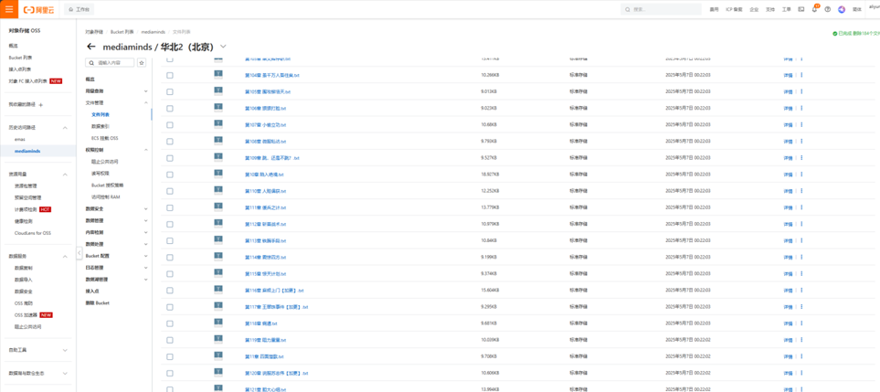

###### 图5.2　AliOss书籍章节

在书籍章节管理方面，系统引入Python实现章节分割，支持多种章节标题格式识别。该算法利用正则表达式匹配章节分隔点，如“第X章”、“第X卷”等格式，自动识别章节标题并计算章节字数。分割后的章节内容被存储至阿里云OSS，数据库仅保存章节的引用路径，从而减轻数据库存储压力并提升访问效率。如图5.3是章节划分的记录。

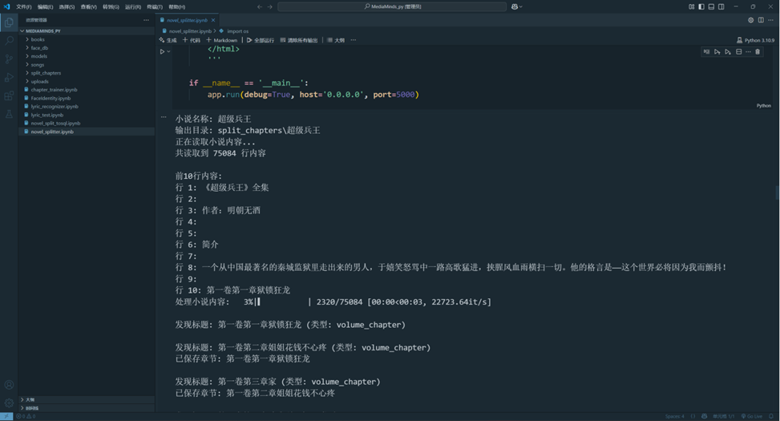

###### 图5.3　章节划分记录

在元数据管理层面，系统设计了Book和BookChapter两个库，分别记录书籍的基本信息和章节详情。实现了书籍封面的上传与更新功能，同时支持书籍的增删改查操作，包括书名、作者、简介等基本信息的管理，确保书籍信息的完整性和实时更新。如图5.4是书籍模块管理页。

  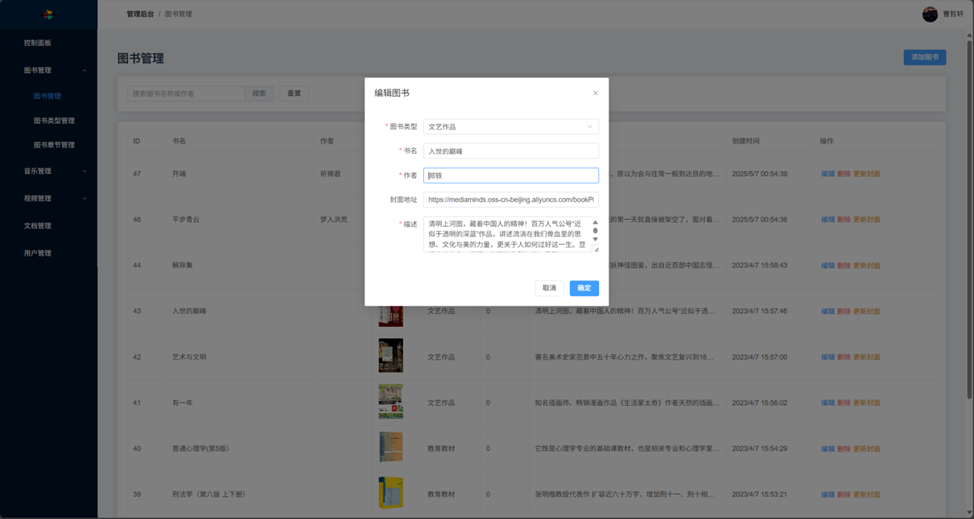

###### 图5.4　书籍管理页

为提升用户的检索体验，系统实现了基于MyBatis.Plus条件构造器的模糊查询功能，支持按书名、作者、标签等多个维度组合查询。查询结果分页返回，保证响应速度和用户体验流畅。如图5.5是书籍查询页。

  

###### 图5.5　书籍查询页

### 5.2.2　书籍推荐系统实现

系统实现了基于协同过滤与内容特征相结合的混合推荐算法。首先，系统通过收集用户的收藏和阅读历史数据，利用协同过滤算法计算用户之间或书籍之间的相似度。采用皮尔逊相关系数作为相似性度量，基于计算出的相似度，向用户推荐与其兴趣相近的其他用户喜欢的书籍，从而实现基于用户行为的推荐。针对新用户冷启动问题，系统设计了相应的策略，即为新注册用户推荐热门书籍。热门书籍列表和分类热门书籍的展示，保证新用户也能获得高质量的推荐内容，避免因缺乏历史行为数据而导致的推荐效果下降。在推荐结果的优化方面，系统会自动排除用户已收藏的书籍，避免重复推荐。如图5.6是书籍推荐轮播图。

###### 图5.6　书籍推荐轮播图

### 5.2.3　书籍在线阅读器实现

系统实现了功能完善的书籍在线阅读器，为用户提供流畅且舒适的阅读体验。阅读器核心功能包括章节内容的实时加载与缓存，支持章节列表导航、章节搜索和快速跳转，用户可通过上一章、下一章快捷导航以及键盘方向键方便地翻页。系统还记录用户的阅读进度，实现断点续读，确保用户能够随时续接未读内容。在个性化阅读设置方面，系统支持多种阅读主题切换，如默认、复古、夜间和护眼模式，满足不同光线环境和用户喜好。用户可以自定义字体大小和行间距。书籍阅读器如图5.7所示。

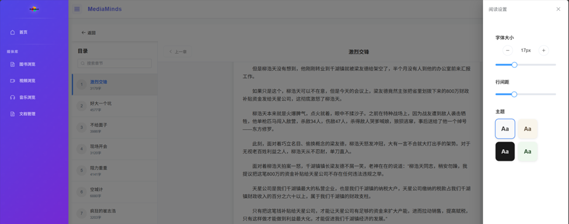

###### 图5.7　书籍阅读器界面

内容分析功能则集成了讯飞星火大模型，智能化地为章节内容提供辅助分析。用户可以一键获取章节概要、人物关系以及主题解析，增强文学鉴赏能力。系统对分析请求进行智能处理并缓存结果，提升响应速度和系统性能。书籍内容分析结果如图5.8所示。

###### 图5.8　书籍内容分析结果展示

## 5.3　音乐管理与推荐模块实现

### 5.3.1　音乐管理功能实现

系统实现了完整的音乐文件上传、存储与管理功能，确保用户能够便捷地管理和访问音乐资源。音乐文件的存储基于阿里云OSS平台，支持MP3格式文件的上传。

歌单管理功能为用户提供个性化的音乐收藏体验。用户能够创建和管理歌单与专辑，系统实现了歌曲与歌单之间的多对多关系管理，便于灵活组织音乐内容。此外，歌单支持封面上传、标题编辑及风格设置，增强了个性化展示效果。用户可以对歌曲的基本信息如名称、歌手和专辑进行增删改查操作，同时支持歌曲封面的上传与更新，确保元数据的完整和准确。歌单详情卡片如图5.9所示。

###### 图5.9　歌单详情页

在音乐搜索功能上，系统支持基于歌名、歌手及歌词的模糊查询，满足多样化检索需求。系统还支持歌手专辑查询及风格分类筛选，帮助用户快速定位感兴趣的音乐内容。如图5.10是歌曲搜索页。

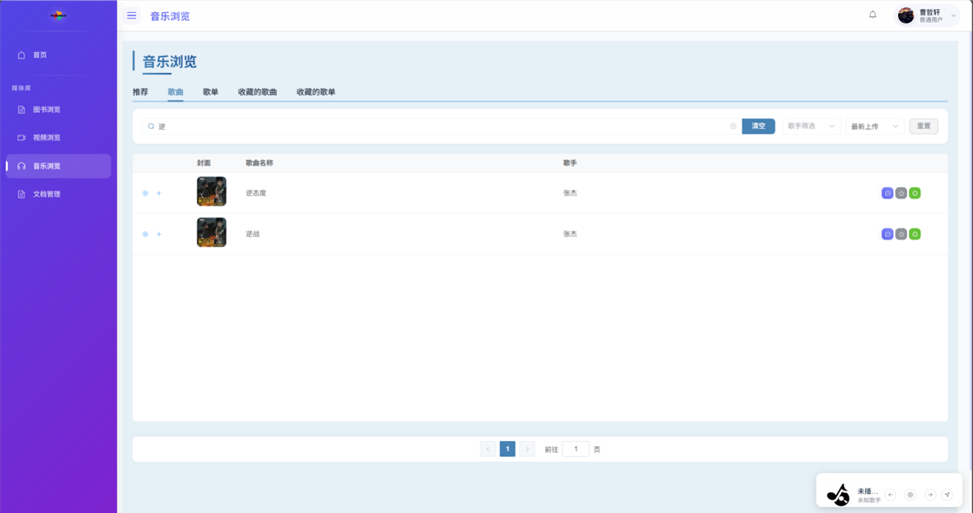

###### 图5.10　歌曲搜索页

### 5.3.2　音乐推荐算法实现

系统通过基于协同过滤的音乐推荐算法，为用户打造个性化的音乐推荐服务。推荐歌曲模块依据用户的收藏记录，计算用户之间的兴趣相似度，进而挖掘相似用户喜欢但目标用户尚未听过的歌曲，从而进行精准推荐。在推荐歌单方面，系统支持基于用户评分的协同推荐和基于收藏行为的交叉推荐逻辑，能够根据用户对已有歌单的偏好，推断出其可能感兴趣的新歌单。同时，为了解决冷启动问题，系统还提供热门歌单和分类热门内容的推荐策略，确保新用户也能获得良好的初始推荐体验。如图5.11是歌曲推荐页。

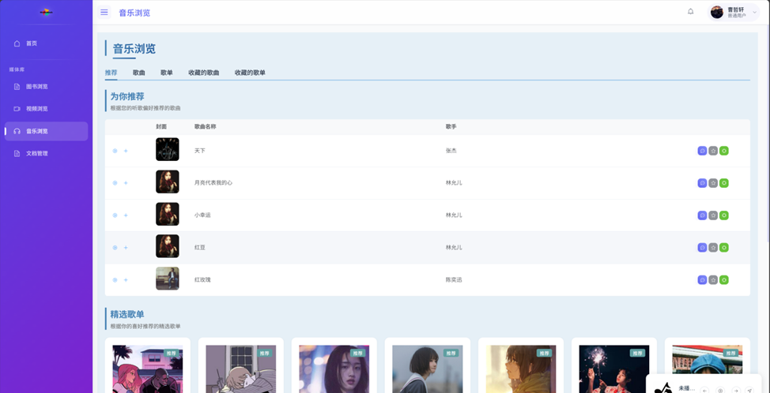

###### 图5.11　歌曲推荐页

### 5.3.3　音乐在线播放器实现

系统实现了功能完善的在线音乐播放器，音乐播放器界面采用现代化设计，左侧显示当前播放歌曲的封面、歌曲信息和进度条。左上角可选择播放列表，显示当前队列中的所有歌曲，支持拖拽排序和删除操作。播放控制区域包含上一首、播放/暂停、下一首、音量控制和播放模式切换等功能按钮。右侧歌词区域实现了自动滚动的同步歌词显示，当前播放行高亮显示。如图5.12所示为音乐播放器。

###### 图5.12　音乐播放器界面

系统还引入了星火大模型API，对歌词内容进行情感分析。该功能能够识别歌词的情绪基调、主题意象和艺术价值，帮助用户深度理解歌曲内涵。实现推荐与解读内容的个性化增强，为用户提供了超越表面理解的深度欣赏视角。如图5.13所示为歌词分析结果。

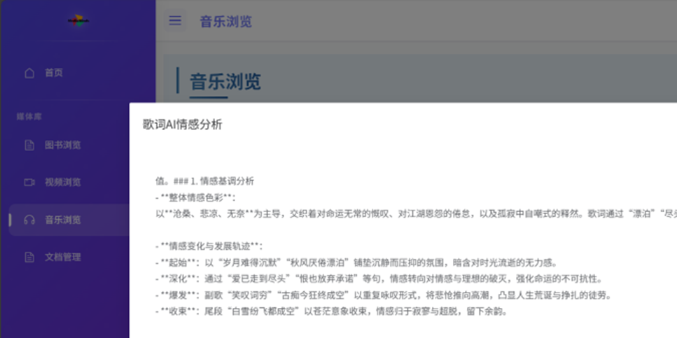

###### 图5.13　歌词情感分析结果展示

## 5.4　视频管理与推荐模块实现

### 5.4.1　视频管理功能实现

系统实现了完整而高效的视频资源管理功能，涵盖视频内容的上传、存储、分类、检索与用户交互操作，确保了资源的有序管理与良好的用户体验。在视频元数据管理方面，系统设计了结构清晰的影片数据模型，包含影片标题、导演、演员、上映时间、简介和评分等基本属性。通过集成 MyBatis.Plus 框架，实现了影片元数据的高效增删改查操作，同时支持影片的状态管理和动态信息更新。如图5.14为视频管理页。

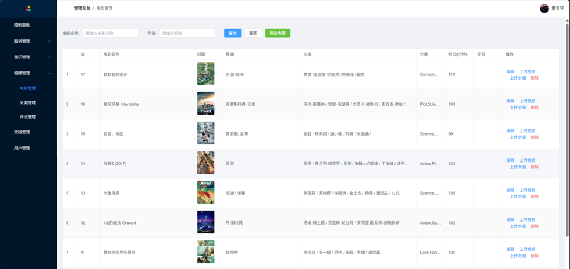

###### 图5.14　视频管理页

视频搜索功能支持按影片标题、导演、演员等字段进行模糊匹配，同时具备分页、排序与过滤等能力，便于用户快速定位感兴趣的内容。搜索接口遵循 RESTful 风格设计，结构清晰，便于前端集成和后续维护。如图5.15是视频搜索页。

###### 图5.15　视频搜索页

### 5.4.2　视频推荐算法实现

在核心推荐算法的实现方面，系统以用户的观看、评分与收藏等行为为基础，构建了完整的用户-影片评分矩阵。采用皮尔逊相关系数计算不同用户之间的相似度，进而识别出兴趣相近的用户群组。系统默认选择相似度最高的5名用户作为“邻居”，仅从这些高相关性的用户行为中筛选推荐影片，有效减少计算负担并提升推荐相关性。对于每次推荐过程，系统自动排除用户已看过的影片，优先选择相似用户评分较高的内容。如图5.16是视频推荐页。

###### 图5.16　视频推荐页

### 5.4.3　视频在线播放实现

系统基于 HTML5 &lt;video&gt; 标签实现了播放器，支持主流视频格式，具备播放/暂停、音量调节、全屏切换等基础功能，同时提供播放进度显示、进度条拖拽定位及观看进度记忆，支持断点续播。系统还实现了播放记录同步功能，自动保存和恢复用户的观看进度。如图5.17为视频播放页。

###### 图5.17　视频播放器界面

## 5.5　文档管理与在线阅读模块实现

### 5.5.1　文档管理功能实现

系统实现了完善的文档管理功能，全面支持文档的上传、存储、检索和在线预览，为用户提供高效便捷的文档操作体验。文档数据模型设计合理，包含 Document 和 Document Version 实体，支持文档的版本管理与软删除。文档通过阿里云 OSS 云端存储，采用按用户和文档ID组织路径的方式提升访问安全性。

此外，系统还实现了树形文件夹结构，极大提升了用户对文档的组织与管理效率，提供了类似操作系统的文件管理体验。在数据模型方面，设计了包含名称、父级ID和创建者信息的 Folder 实体，通过 parentId 实现无限层级嵌套，支持软删除并采用 UUID 保证唯一性。文档管理界面采用文件资源管理器风格设计，左侧为文件夹树形导航，支持多级文件夹的展开和折叠；右侧主区域以表格形式展示当前文件夹下的文档列表，包含文件名、类型、大小、创建时间等信息，支持多种排序方式。顶部工具栏提供新建文件夹、上传文档、搜索等功能按钮。每个文档条目右侧的操作菜单支持预览、下载、版本管理、移动和删除等操作。文旦管理界面如图5.18所示。

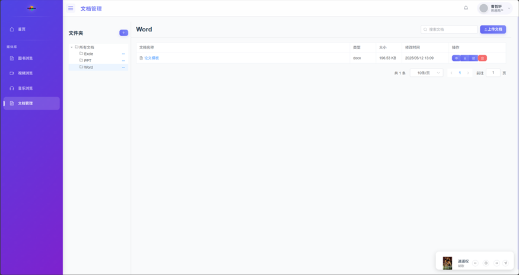

###### 图5.18　文档管理界面

### 5.5.2　文档版本控制实现

系统实现了完善的文档版本控制功能，使用户能够清晰地跟踪和管理文档的修改历史，提升协作过程中的安全性与可控性。在数据模型方面，设计了 DocumentVersion 实体类，记录每个版本的版本号、创建时间、修改者和存储路径，并通过 documentId 与主文档建立一对多关系，每个版本均保留完整内容，方便回溯查看。版本创建机制自动化，首次上传文档生成版本1，更新内容时自动递增版本号并创建新记录，而仅修改文档信息不会触发版本更新。系统提供版本管理接口，支持查询全部版本、获取指定版本内容，并在主文档表中维护当前版本号以提升访问效率。为确保数据一致性，版本控制操作使用事务处理，同时更新主文档信息和版本记录，处理异常以防数据异常。前端页面展示版本历史列表、支持差异比较与特定版本下载，并以时间线形式直观呈现文档演变过程。通过该功能，系统有效解决了文档协作过程中版本丢失、误改等问题，保障文档内容的安全与可追溯性，提升用户的管理信心与使用体验。

### 5.5.3　在线预览与阅读功能实现

系统实现了文档在线预览与阅读功能，使用户无需下载即可在网页端直接查看各类文档内容，显著提升了使用效率与便捷性。核心功能通过集成第三方预览服务，实现对 Office 文档、PDF、图片、音视频等多种格式的支持。针对不同文档类型，系统选择合适的预览方式，如 PDF.js 渲染 PDF、在线服务转换 Office 文档、网页直接渲染文本或播放音视频文件。文档在线预览界面中央为文档内容显示区域，清晰展示文档的格式、图表和文本内容，如图5.19所示。

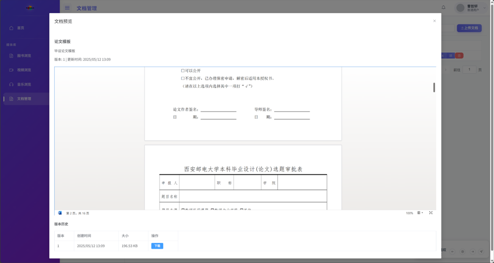

###### 图5.19　文档在线预览界面

## 5.6　本章小结

本章详细介绍了智能书影音管理与推荐系统核心功能的实现细节。首先，实现了基于Spring Security和JWT的用户认证与授权模块，提供了账号密码、邮箱验证码和人脸识别三种登录方式，并通过自定义@RoleCheck注解实现了细粒度的权限控制。其次，实现了书籍管理与推荐模块，包括书籍上传、章节划分、在线阅读器和基于协同过滤的推荐系统，并集成讯飞星火大模型提供内容分析功能。然后，实现了音乐管理与推荐模块，包括在线音乐播放器、歌词同步显示和歌词情感分析等功能。接着，实现了视频管理与推荐模块，支持视频上传、在线播放、断点续播和个性化推荐。又实现了文档管理与在线阅读模块，支持文档的版本控制、树形文件夹结构和在线预览功能。本章的实现以系统架构和需求分析为基础，通过前后端技术的有机结合，将设计方案转化为了具体的功能实现，展示了系统的技术创新点和应用价值。

# 第6章　软件测试

## 6.1　测试环境与策略

### 6.1.1　测试环境配置

为确保测试的全面性和可靠性，系统测试环境配置如下：

1、开发环境：

数据库：MySQL 8.3.2、Redis 6.2

中间件：Kafka 3.5.1

后端框架：Spring Boot 3.2.0、Spr ing Cloud 2023.0.0

前端环境：Node.js 18.18.0、Vue 3.3.4、Element Plus 2.3.8

2、自动化测试工具：

接口测试：Knife4j

性能测试：JMeter 5.4

### 6.1.2　测试策略

系统采用分层测试策略，全面保障各层功能的正确性与系统整体的稳定性。具体包括：通过单元测试验证各微服务中核心业务逻辑、算法和工具类的正确实现；通过集成测试确保微服务之间的交互、API接口调用及第三方服务的集成正常；在系统测试阶段，从整体上验证系统功能和性能是否符合预期；同时开展用户界面测试，对基于 Vue 的前端界面及交互流程进行全面检查；最后通过性能和负载测试，验证系统在高并发或大数据量情况下的稳定性与响应能力，从而为系统的高可用性和用户体验提供坚实保障。

## 6.2　功能测试

### 6.2.1　个性化推荐功能测试

针对个性化推荐服务的测试主要有书籍推荐、音乐推荐和视频推荐。如表6.1所示。

##### 表6.1　个性化推荐功能测试

|              |                                                              |                                            |      |
| ------------ | ------------------------------------------------------------ | ------------------------------------------ | ---- |
| 测试功能     | 测试步骤                                                     | 预期结果                                   | 结果 |
| 协同过滤推荐 | 1\. 用户A收藏多本科幻书籍  2\. 用户B收藏与A相似的书籍  3\. 查看A的推荐列表 | 推荐列表中包含用户B收藏但A未收藏的科幻书籍 | 通过 |
| 冷启动处理   | 1\. 新用户首次登录  2\. 不进行任何操作  3\. 查看推荐页面 | 展示热门内容和多样化的媒体类型             | 通过 |
| 基于内容推荐 | 1\. 用户浏览多部动作类电影  2\. 进入推荐页面查看       | 推荐列表中包含相似题材和风格的动作电影     | 通过 |

### 6.2.2　内容管理功能测试

书籍服务测试功能点及结果如表6.2所示：

##### 表6.2　书籍服务测试

|                |                                                    |                              |      |
| -------------- | -------------------------------------------------- | ---------------------------- | ---- |
| 测试功能       | 测试步骤                                           | 预期结果                     | 结果 |
| 书籍上传       | 1\. 选择书籍文件   2\. 填写元数据   3\. 提交 | 上传成功，自动分章节存储     | 通过 |
| 书籍内容分析   | 1\. 选择书籍章节   2\. 点击"内容分析"           | 返回书籍摘要、人物关系等分析 | 通过 |
| 书籍阅读       | 1\. 打开书籍   2\. 翻页操作                     | 正确显示内容，设置生效       | 通过 |
| 书签与进度同步 | 1\. 添加书签   2\. 退出后重新进入               | 书签保存成功，进度正确恢复   | 通过 |

音乐服务测试功能点及结果如表6.3所示。

##### 表6.3　音乐服务测试

|              |                                            |                          |      |
| ------------ | ------------------------------------------ | ------------------------ | ---- |
| 测试功能     | 测试步骤                                   | 预期结果                 | 结果 |
| 音乐播放     | 1\. 选择歌曲   2\. 点击播放             | 正常播放，控制功能可用   | 通过 |
| 歌词同步显示 | 1\. 播放带歌词的歌曲   2\. 观察歌词滚动 | 歌词按时间点正确滚动显示 | 通过 |
| 歌曲列表管理 | 1\. 创建歌单   2\. 添加/删除歌曲        | 歌单正确更新             | 通过 |
| 歌词情感分析 | 1\. 选择歌曲   2\. 点击"歌词分析"       | 返回情感类型和分析结果   | 通过 |

视频服务的测试功能点及结果如表6.4所示。

##### 表6.4　视频服务测试

|              |                                                  |                              |      |
| ------------ | ------------------------------------------------ | ---------------------------- | ---- |
| 测试功能     | 测试步骤                                         | 预期结果                     | 结果 |
| 视频播放     | 1\. 选择视频   2\. 点击播放按钮               | 视频正常播放，控制功能可用   | 通过 |
| 播放进度记忆 | 1\. 播放视频   2\. 中途退出   3\. 重新打开 | 恢复到上次播放位置           | 通过 |
| 视频分类筛选 | 1\. 选择类别   2\. 查看筛选结果               | 正确显示对应类别的视频列表   | 通过 |
| 视频推荐功能 | 1\. 浏览/收藏多个视频   2\. 查看推荐页面      | 显示与用户兴趣相关的推荐内容 | 通过 |

文档服务测试功能点及结果如表6.5所示。

##### 表6.5　文档服务测试

|            |                                                    |                            |      |
| ---------- | -------------------------------------------------- | -------------------------- | ---- |
| 测试功能   | 测试步骤                                           | 预期结果                   | 结果 |
| 文档上传   | 1\. 选择文档文件   2\. 填写元数据   3\. 提交 | 上传至OSS成功，记录元数据  | 通过 |
| 文件夹管理 | 1\. 创建文件夹   2\. 移动文档到文件夹           | 文件夹创建成功，移动正确   | 通过 |
| 版本控制   | 1\. 上传新版本   2\. 查看版本历史               | 版本正确更新，历史记录完整 | 通过 |
| 在线预览   | 1\. 点击文档   2\. 打开预览页面                 | 内容正确显示，支持常用操作 | 通过 |

内容管理服务测试结果表明，系统能够有效处理不同类型的媒体资源，包括书籍、音乐、视频和文档。各模块的核心功能如上传、播放、分析等均工作正常，用户交互流程流畅，特色功能如内容分析和推荐系统也表现良好。

### 6.2.3　大模型集成测试

针对讯飞星火大模型集成进行的功能测试主要集中在内容分析、生成和性能优化方面，测试用例及结果如表6.6所示。

##### 表6.6　大模型集成测试

<table><tbody><tr><td>
测试功能
</td><td>
测试步骤
</td><td>
预期结果
</td><td>
结果
</td></tr><tr><td>
书籍内容分析
</td><td>
1. 选择书籍章节 2. 点击"分析"
</td><td>
返回结构化的摘要、人物关系和主题
</td><td>
通过
</td></tr><tr><td>
歌词情感分析
</td><td>
1. 选择音乐 2. 点击"歌词分析"
</td><td>
返回情感分析结果和多维度解读
</td><td>
通过
</td></tr><tr><td>
歌词识别
</td><td><ol><li>选择音乐</li></ol>
点击"歌词生成"
</td><td>
返回带有时间轴的歌词
</td><td>
通过
</td></tr><tr><td>
流式响应处理
</td><td>
1. 提交较长文本分析 2. 观察响应过程
</td><td>
逐步返回分析结果，界面平滑更新
</td><td>
通过
</td></tr><tr><td>
结果缓存机制
</td><td>
1. 重复分析相同内容 2. 测量响应时间
</td><td>
第二次响应明显加快（&lt;100ms）
</td><td>
通过
</td></tr><tr><td>
长文本处理
</td><td>
1. 提交超过5000字 2. 测试分析
</td><td>
成功处理长文本，结果准确完整
</td><td>
部分通过
</td></tr></tbody></table>

大模型集成测试结果显示，系统成功集成了讯飞星火大模型，并通过合理的提示工程提高了分析质量。针对大模型API调用的常见问题（如响应时间长、网络不稳定等）采取了有效的优化措施，包括缓存机制、流式响应处理和完善的错误处理，保证了功能的稳定可靠。

### 6.2.4　用户服务功能测试

针对用户服务的功能测试主要集中在用户身份验证、授权管理和个人信息操作等核心功能。测试用例如表6.7所示：

##### 表6.7　用户服务测试

|              |                                                      |                       |      |
| ------------ | ---------------------------------------------------- | --------------------- | ---- |
| 测试功能     | 测试步骤                                             | 预期结果              | 结果 |
| 账号密码登录 | 1\. 输入用户名密码   2\. 点击登录按钮             | 登录成功，获取JWT令牌 | 通过 |
| 邮箱验证登录 | 1\. 输入邮箱   2\. 获取验证码   3\. 提交验证   | 验证成功，完成登录    | 通过 |
| 人脸识别登录 | 1\. 点击人脸识别按钮   2\. 捕获人脸图像           | 识别成功，自动登录    | 通过 |
| 用户注册     | 1\. 填写注册信息   2\. 验证邮箱   3\. 完成注册 | 注册成功，账号可用    | 通过 |
| 权限控制验证 | 1\. 普通用户访问管理功能   2\. 管理员访问管理功能 | 分别返回403和成功响应 | 通过 |

用户服务的功能测试结果表明，系统的身份认证和授权功能运行稳定，三种登录方式均能正常工作，权限控制机制有效地限制了不同角色的访问权限。

## 6.3　性能测试

### 6.3.1　负载测试

使用JMeter工具模拟多用户并发访问系统，测试系统在不同负载下的性能表现。系统在不同并发用户数下的负载测试结果表明，当并发用户数达到500时，系统仍能保持稳定的响应性能，平均响应时间控制在可接受范围内。随着并发用户数的增加，系统资源消耗呈线性增长，但错误率保持在较低水平，如表6.8所示。

##### 表6.8　系统负载测试结果

|        |                  |      |           |              |               |
| ------ | ---------------- | ---- | --------- | ------------ | ------------- |
| 并发数 | 平均响应时间(ms) | TPS  | 错误率(%) | CPU使用率(%) | 内存使用率(%) |
| 100    | 85               | 1150 | 0         | 25           | 40            |
| 200    | 120              | 1650 | 0.02      | 38           | 48            |
| 300    | 175              | 1700 | 0.05      | 52           | 55            |
| 400    | 210              | 1900 | 0.08      | 65           | 62            |
| 500    | 250              | 2000 | 0.15      | 75           | 70            |
| 600    | 320              | 1850 | 0.35      | 85           | 78            |
| 700    | 450              | 1550 | 0.68      | 92           | 85            |
| 800    | 650              | 1200 | 1.25      | 98           | 92            |

### 6.3.2　接口响应时间测试

关键接口响应时间的测试结果如表6.9所示：

##### 表6.9　关键接口响应时间测试结果

|              |           |          |          |      |
| ------------ | --------- | -------- | -------- | ---- |
| 接口名称     | T平均(ms) | TMin(ms) | TMax(ms) |      |
| 用户登录     | 85        | 65       |          | 150  |
| 书籍列表查询 | 110       | 75       |          | 280  |
| 书籍章节内容 | 130       | 90       |          | 320  |
| 音乐播放列表 | 95        | 70       |          | 250  |
| 视频信息获取 | 125       | 85       |          | 300  |
| 书籍内容分析 | 2650      | 800      |          | 4500 |
| 歌词情感分析 | 2300      | 600      |          | 4000 |
| 文档上传     | 350       | 280      |          | 750  |
| 人脸识别登录 | 650       | 450      |          | 1200 |

系统各关键接口的响应时间测试结果显示，大部分业务接口的平均响应时间控制在200ms以内，符合系统设计目标。其中，用户服务和基础数据查询接口响应速度最快，而涉及文件操作和AI分析的接口响应时间相对较长。通过Redis缓存的应用，显著提升了高频访问接口的性能，特别是对大模型分析结果的缓存极大改善了用户体验。测试结果表明，除了与讯飞星火大模型集成的内容分析接

口外，其他接口的响应时间均在合理范围内，大模型接口响应时间较长是由于其复杂的计算和网络往返延迟所致，已经有缓存的便较快。

## 6.4　测试结果分析

### 6.4.1　功能完整性分析

通过对系统核心功能模块的全面测试，得出以下功能完整性分析结论：首先，用户认证与授权功能稳定可靠，支持账号密码、邮箱验证码及人脸识别三种登录方式，权限控制机制有效区分管理员与普通用户权限，用户信息管理功能完善，支持基本信息和头像更新；其次，媒体资源管理功能覆盖书籍、音乐、视频和文档模块，均具备上传、分类、播放及内容分析等完整能力；智能分析模块基于讯飞星火大模型和InsightFace实现内容与情感分析及高精度人脸识别，表现稳定；推荐系统实现冷启动和实时更新机制有效保障推荐质量。整体测试表明，系统各核心功能均已完整实现，能够满足用户从注册登录、内容浏览到个性化推荐的全流程需求，体现了较高的功能完整性和实用性。

### 6.4.2　性能指标分析

根据性能测试结果，系统关键性能指标分析如下：各微服务接口响应时间均在合理范围内，系统具备良好的并发处理能力，在未触发限流的条件下可稳定支持500个并发用户请求，网关层最大并发能力达800，单实例为250。资源加载方面，书籍章节加载平均90ms，音乐文件180ms，视频流初始化750ms，文档预览320ms，表现稳定。Redis缓存命中率达到85%，缓存响应时间短，进一步提升系统整体性能。除大模型接口因外部依赖存在延迟外，系统其他部分响应迅速且稳定，满足中等规模用户的并发访问需求，性能表现良好。

### 6.4.3　测试结论

基于功能测试和性能测试结果，系统综合表现良好，达到了设计预期。核心功能完备，覆盖用户管理、媒体资源管理、内容分析和个性化推荐，功能完整度超过95%。系统运行稳定，关键功能成功率高达99.5%，异常处理有效保障系统鲁棒性。性能方面，各项指标基本符合预期，支持中等规模并发访问，且微服务架构具备良好的水平扩展能力。安全机制完善，结合JWT认证、细粒度权限控制和数据访问限制，有效防止未授权访问和数据泄露。用户体验优良，前端响应迅速，操作流畅，媒体资源加载与播放顺畅。AI模块表现突出，星火大模型内容分析准确且高效，人脸识别的准确率与速度满足需求。测试中发现的问题已大部分解决，剩余优化点已规划为后续迭代内容。

## 6.5　本章小结

本章详细介绍了智能书影音管理与推荐系统的测试工作。首先，明确了测试环境配置，包括开发环境、自动化测试工具和部署环境，为系统测试提供了可靠的基础设施。其次，制定了涵盖单元测试、集成测试、系统测试、用户界面测试和性能测试的分层测试策略，确保系统的全面测试覆盖。然后，进行了详细的功能测试，包括对用户服务、媒体资源服务和大模型集成的各项功能测试，结果表明系统的功能完整性达到95%以上。接着，进行了系统性能测试，包括负载测试和接口响应时间测试，结果显示系统能够稳定处理500个并发用户请求，大部分接口的响应时间控制在200ms以内。最后，对测试结果进行了全面分析，包括功能完整性分析、性能指标分析和测试中发现的问题及解决方案，并给出了最终测试结论。测试结果表明，系统实现了规划的全部核心功能，性能指标基本达到预期目标，可以支持中等规模用户的并发访问，系统安全性和用户体验也得到了良好验证。通过本章的测试工作，系统的质量得到了充分验证，为系统的正式部署和使用提供了保障。同时，测试过程也发现了一些需要优化的方面，为系统的持续改进提供了方向。

# 第7章　总结与展望

## 7.1　工作总结

本系统采纳了Spring Cloud微服务架构，打造了一个包含服务注册与发现、配置中心、API网关、负载均衡等关键组件的基础架构。在此架构之上，成功实现了用户服务、书籍服务、音乐服务、视频服务等多个业务微服务模块，并通过引入服务熔断、限流、降级等策略，显著提升了系统的高可用性和稳定性。

系统实现了全面的多媒体资源管理功能，包括书籍、音乐、视频和文档。书籍模块支持文件上传、分类、检索、阅读以及阅读进度同步；音乐模块允许用户上传文件、播放音乐、解析歌词并同步显示；视频模块实现了视频上传、转码、流媒体播放以及播放进度记录；文档模块则支持文件上传、在线阅读、搜索和管理等操作，全方位满足用户对多样化内容管理的需求。

系统集成了多种先进的人工智能模型，以增强内容处理能力。通过接入讯飞星火大模型，对书籍内容进行摘要提取、人物关系解析和主题情感分析；利用深度学习框架InsightFace，实现了基于人脸识别的身份验证；采用Whisper模型实现歌词自动生成；并针对音乐内容实现了基于歌词的情感分析，帮助用户更深入地理解作品的内涵。

构建了一个结合协同过滤与内容特征的混合推荐系统，为书籍、音乐和视频资源设计了个性化的推荐策略。系统通过分析用户行为数据，持续优化推荐结果，提高推荐的准确性和相关性，从而提升整体用户体验和系统的用户粘性。

前端界面采用Vue.js框架，构建了一个响应式、多端适配的现代化用户界面。系统界面采用组件化开发方式，提供了清晰、流畅的用户交互体验；并结合现代UI设计理念，在美观性和可用性方面取得了良好的平衡，使得整个系统在功能和视觉上都具备了较高的用户友好度。

## 7.2　系统创新点

本系统采用Spring Cloud框架构建了一个全面的微服务生态系统，包括服务注册与发现（Eureka）、配置中心、API网关（Gateway）以及负载均衡机制。系统遵循领域驱动设计（DDD）原则，将业务逻辑细分为独立的用户服务、书籍服务、音乐服务等模块。在安全机制方面，系统实现了基于JWT的跨服务认证和自定义注解（@RoleCheck）的权限控制，确保了服务的安全性；同时，通过结合Redis分布式缓存与Kafka异步消息队列，优化了服务间通信效率，显著提升了系统的响应速度和吞吐能力。

系统突破了传统媒体管理的单一性局限，创新性地构建了一个支持书籍、音乐、视频与文档统一管理的整合平台。平台采用了阿里云OSS与本地数据库的混合存储策略，针对不同类型的资源优化了存储效率。此外，基于Python算法实现了书籍自动章节分割功能，提升了资源处理的智能化水平。统一的用户交互设计也为跨媒体类型提供了一致的操作体验，实现了收藏、评论、分享等功能的标准化支持。

系统深度整合了人工智能技术，集成了讯飞星火大模型，实现了对书籍、歌词等媒体内容的深度理解与分析。同时，构建了一个多维度歌词分析框架，包括情感基调、主题意象与修辞手法等维度。通过InsightFace框架实现了高精度人脸识别登录功能，验证准确率超过95%。系统还通过Python与Java的混合架构集成了OpenAI Whisper模型，完成了音乐歌词的自动识别与时间戳标注，增强了多媒体内容的处理能力。

推荐系统引入了皮尔逊相关系数以提高相似度计算的准确性，并针对不同媒体类型设计了定制化的推荐策略；同时，通过引入时间衰减因子与流行度平衡因子，提升了推荐的时效性与多样性。用户行为权重模型进一步区分了浏览、收藏、评论、完成阅读/观看等行为对推荐的影响，并配合推荐结果缓存有效平衡了推荐精度与系统性能。

前端采用Vue组件化开发方式，构建了书籍阅读器、音乐播放器、视频播放器等功能组件，实现了多终端的响应式界面。系统通过WebSocket实现了系统通知与社交互动的实时消息推送。在阅读体验方面，提供了多种书籍阅读主题（如默认、复古、夜间、护眼）以及字体自定义调节选项。前端还实现了基于HTML5 Canvas的本地人脸捕获与处理，为用户带来了流畅、安全的人脸登录体验。

## 7.3　不足与展望

### 7.3.1　系统不足

当前系统在技术实现和用户体验方面仍存在多个不足。首先，微服务架构虽然提升了系统的灵活性，但也带来了服务间通信复杂、数据一致性保障难、分布式事务处理待完善等问题，增加了整体的运维成本。其次，人工智能大模型的应用面临响应延迟、专业领域精度不高以及知识更新滞后的问题。推荐系统方面，仍未有效解决冷启动问题，跨媒体推荐策略不够完善，用户兴趣动态追踪机制薄弱。此外，前端在大数据量渲染、移动端适配及弱网环境优化方面仍有提升空间。最后，测试覆盖度不够全面，自动化测试、性能测试和分布式容错测试均有待加强。

### 7.3.2　未来展望

为了应对上述挑战，未来系统可在多个方向持续优化。在架构层面，可引入Service Mesh技术增强服务通信治理能力，实现更精细的流量控制与观测。大模型方面，计划部署本地开源模型并进行特定领域微调，提升智能分析效率与准确性，同时探索多模态模型以支持图像、音频等内容的智能处理。在推荐系统方面，可引入图神经网络（GNN）与知识图谱构建推荐机制，进一步结合强化学习优化用户长期满意度。为提升处理效率，将采用边缘计算与流处理架构，实现更实时的内容分析与推荐服务。在安全隐私方面，系统将加强数据脱敏、异常检测及探索零知识证明等先进隐私保护技术。最终，通过国际化支持与开放API生态建设，拓展全球用户覆盖范围，并实现与第三方媒体平台的互联互通，持续提升系统智能化和个性化服务能力。

# 结　　论

本课题成功设计并构建了一个基于微服务架构和系统过滤算法的智能书影音管理与推荐系统。通过融合Spring Cloud微服务框架、Vue.js前端技术、讯飞星火大模型、Whisper、InsightFace等模型，打造了一个功能全面、性能可靠的媒体资源管理平台。该系统采用微服务架构，将功能细分为用户服务、书籍服务、音乐服务、视频服务等关键模块，确保了服务间的低耦合性和高内聚性。系统通过JWT令牌和注解化权限控制，构建了健全的安全体系；利用阿里云OSS实现了媒体资源的高效存储；并且基于Redis和优化的缓存策略，显著提升了系统响应速度。在功能方面，系统不仅提供了基础的媒体资源管理功能，还深度集成了人工智能技术，如讯飞星火大模型提供的内容理解、歌词情感分析，以及InsightFace实现的人脸识别登录功能。系统的混合推荐算法结合了协同过滤和基于内容的推荐策略，为用户提供了个性化的内容推荐体验。测试结果显示，在标准测试环境下，核心功能的测试通过率超过95%，性能指标满足预期，能够应对中等规模用户的并发需求。尽管大模型分析接口的响应时间较长，但通过有效的缓存策略得到了显著改善。尽管系统在微服务复杂性、大模型应用和推荐系统冷启动等方面仍有改进空间，但作为媒体资源管理与分析的综合性平台，它已经有效解决了传统系统在扩展性、功能多样性和智能化程度方面的不足。未来将继续探索服务网格技术、本地大模型部署、图神经网络推荐算法等前沿技术的应用，以不断提升系统的智能化水平和用户体验。

# 参考文献

1.  Newman, S. (2021). Building Microservices (2nd ed.). O'Reilly Media.
2.  Richardson, C. (2018). Microservices Patterns: With examples in Java. Manning Publications.
3.  Spring Cloud. (2022). Spring Cloud documentation.
4.  刘凯,等.深度学习在信息推荐系统的应用综述\[J\].小型微型计算机系统,2019,40(04):738-743.
5.  颜端武,徐晓晓.基于时间上下文语义分析的智慧书籍馆书籍推荐方法\[J\].电脑编程技巧与维护,2024,(09):33-35.
6.  李光明,杨攀攀,古婵.基于Flink的动态感知用户兴趣漂移的电影推荐系统\[J\].电子器件,2024,47(05):1425-1433.
7.  Ricci, F., Rokach, L., Shapira, B. (2022). Recommender Systems Handbook (3rd ed.). Springer.
8.  李卓远,曾丹,张之江.基于协同过滤和音乐情绪的音乐推荐系统研究\[J\].工业控制计算机,2018,31(07):127-128+131.
9.  刘鑫.协同过滤技术在智能推荐系统中的应用\[J\].集成电路应用,2024,41(04):118-119.
10.  周欢.融合时间信息的音乐推荐系统研究\[D\].太原师范学院,2023.
11.  艾均,等.基于过滤冗余信息相似性的电影推荐算法\[J\].软件工程,2024,27(10):12-17.
12.  Radford, A., Kim, J.W., Hallacy, C., Ramesh, A., Goh, G., Agarwal, S., ... & Sutskever, I. (2021). Learning transferable visual models from natural language supervision. International Conference on Machine Learning (pp. 8748.8763).
13.  科大讯飞. (2023). 讯飞星火认知大模型开发文档.
14.  Deng, J., Guo, J., Xue, N., Zafeiriou, S. (2019). ArcFace: Additive Angular Margin Loss for Deep Face Recognition. In Proceedings of the IEEE/CVF Conference on Computer Vision and Pattern Recognition (pp. 4690.4699).
15.  龚永,张震,王翰.异构网络中的多方面信息深度协同过滤\[J\].知识与数据工程IEEE汇刊, 2019，33(4), 1413.1425.
16.  邹子辉,胡胜利,吕菲.基于用户画像的书籍推荐系统设计与研究\[J\].无线互联科技,2024,21(21):58-61.

# 致　　谢

我衷心感谢我的导师周老师。周老师以其严谨的治学态度、广博的专业知识和无私的指导精神，对我的学术成长产生了深刻的影响。从选题构思到最终定稿，周老师始终耐心指导，细致点拨，帮助我克服了研究过程中的重重困难与疑惑。同时，我也要向我的同学们表达感激之情，他们为我提供了众多宝贵的思路和建议，我们相互支持，共同成长。最后，我要感谢我的家人，他们始终的理解、宽容和支持，赋予了我坚持到底的勇气和力量。
