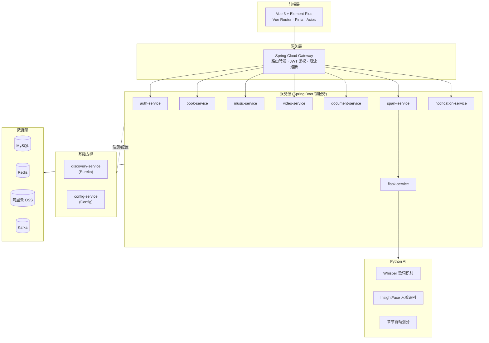
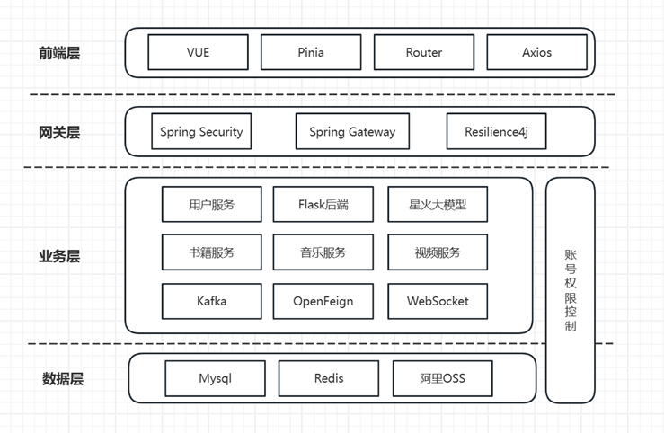
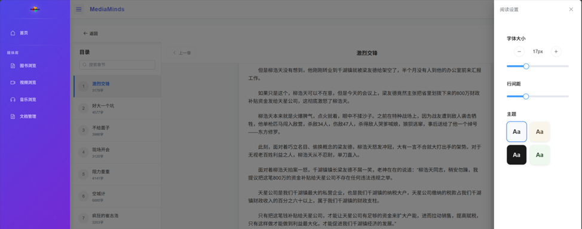
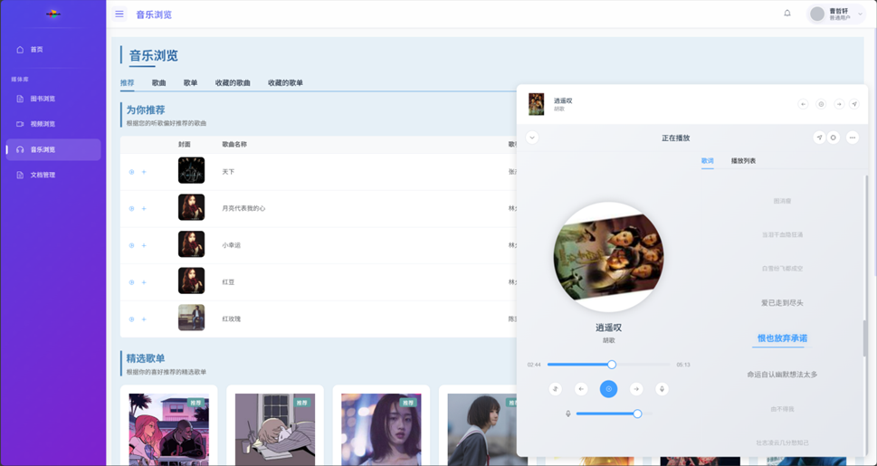
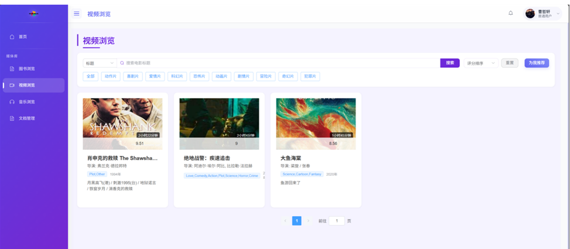
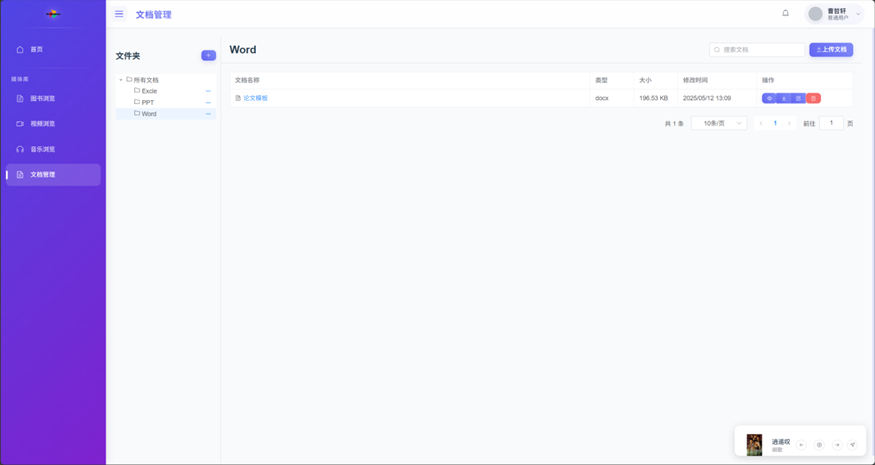
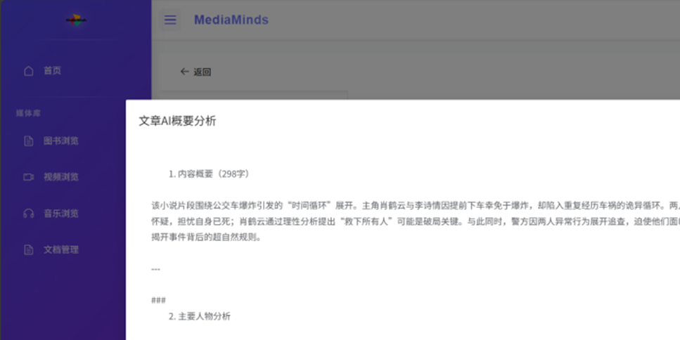

# MediaMinds · 智能书影音管理与推荐系统

> 基于 **Spring Cloud 微服务 + Vue 3 + Python AI** 的一站式书影音资源管理平台，集成讯飞星火大模型、Whisper 语音识别与 InsightFace 人脸识别，提供书籍、音乐、视频、文档的统一管理与个性化推荐。


---

## 📖 目录

- [项目简介](#-项目简介)
- [核心功能](#-核心功能)
- [系统架构](#-系统架构)
- [技术栈](#-技术栈)
- [目录结构](#-目录结构)
- [快速开始](#-快速开始)
- [配置说明](#-配置说明)
- [界面预览](#-界面预览)
- [文档与更新](#-文档与更新)
- [作者与许可](#-作者与许可)

---

## 📌 项目简介

随着数字化时代的到来，各类媒体资源呈爆炸式增长，传统媒体资源管理系统面临**扩展性差、功能单一、智能化程度低**等问题，用户难以在海量内容中快速找到感兴趣的资源。

MediaMinds 采用 **微服务架构** 与 **前后端分离** 设计，围绕书籍、音乐、视频、文档四类媒体资源构建统一管理平台，并深度融合人工智能技术：

- 使用 **Spring Cloud** 构建服务注册发现、配置中心、API 网关与业务微服务生态；
- 使用 **Vue 3** 构建响应式前端界面，提供流畅直观的交互体验；
- 集成 **讯飞星火大模型** 实现书籍内容理解、歌词情感分析等智能能力；
- 应用 **InsightFace** 提供人脸识别登录，**Whisper** 实现歌词与字幕自动生成；
- 设计 **协同过滤 + 基于内容的混合推荐算法**，实现个性化内容推荐。

> 📄 本仓库同时包含配套本科毕业设计论文，正文见 [`PAPER.md`](./PAPER.md)。

---

## ✨ 核心功能

| 模块 | 功能 |
| --- | --- |
| 👤 **用户服务** | 账号密码 / 邮箱验证码 / 人脸识别三种登录方式；注册、信息维护、头像上传；基于角色的权限管理 |
| 📚 **书籍服务** | 书籍与章节管理、封面上传（OSS）、Python 自动章节划分、在线阅读器（多主题、字体调节、断点续读）、章节内容分析 |
| 🎵 **音乐服务** | 歌曲 / 歌手 / 歌单管理、歌词编辑、在线播放与歌词同步、Whisper 歌词自动生成、歌词情感分析 |
| 🎬 **视频服务** | 影片 / 分类 / 标签管理、在线播放、播放进度记忆、评论、点赞与收藏 |
| 📁 **文档服务** | 文档上传管理、树形文件夹、版本控制与回溯、多格式在线预览 |
| 🤖 **智能分析** | 星火大模型封装：书籍摘要 / 人物关系 / 主题分析、歌词情感分析、文档摘要与关键词、通用对话 |
| 🎯 **个性化推荐** | 协同过滤（皮尔逊相关系数）、基于内容的推荐、混合推荐、冷启动热门推荐 |

---

## 🏗 系统架构

系统整体分为四层：**前端层 → 网关层 → 服务层 → 数据层**。


```mermaid
flowchart TB
    subgraph FE["前端层"]
        VUE["Vue 3 + Element Plus<br/>Vue Router · Pinia · Axios"]
    end

    subgraph GW["网关层"]
        GATEWAY["Spring Cloud Gateway<br/>路由转发 · JWT 鉴权 · 限流熔断"]
    end

    subgraph SVC["服务层 (Spring Boot 微服务)"]
        AUTH["auth-service"]
        BOOK["book-service"]
        MUSIC["music-service"]
        VIDEO["video-service"]
        DOC["document-service"]
        SPARK["spark-service"]
        NOTI["notification-service"]
        FLASK["flask-service"]
    end

    subgraph INFRA["基础支撑"]
        EUREKA["discovery-service<br/>(Eureka)"]
        CONFIG["config-service<br/>(Config)"]
    end

    subgraph PY["Python AI"]
        WHISPER["Whisper 歌词识别"]
        FACE["InsightFace 人脸识别"]
        SPLIT["章节自动划分"]
    end

    subgraph DATA["数据层"]
        MYSQL[("MySQL")]
        REDIS[("Redis")]
        OSS[("阿里云 OSS")]
        KAFKA[("Kafka")]
    end

    VUE --> GATEWAY
    GATEWAY --> AUTH & BOOK & MUSIC & VIDEO & DOC & SPARK & NOTI
    SPARK --> FLASK
    FLASK --> PY
    SVC --> DATA
    SVC -.注册/配置.-> INFRA
```



---

## 🧰 技术栈

| 层次 | 技术选型 |
| --- | --- |
| 微服务框架 | Spring Boot 3.4.4、Spring Cloud 2024.0.1 |
| 服务治理 | Eureka（注册发现）、Spring Cloud Gateway（网关）、Spring Cloud Config（配置中心） |
| 服务通信 | OpenFeign、RESTful API、Kafka（异步消息） |
| 安全认证 | Spring Security、JWT、自定义 `@RoleCheck` 注解、RBAC |
| 前端 | Vue 3.3、Vue Router、Pinia、Axios、Element Plus、ECharts、Quill |
| 持久化 | MySQL 8.x、MyBatis-Plus、Redis 6.x |
| 对象存储 | 阿里云 OSS |
| 实时通信 | WebSocket / STOMP |
| 人工智能 | 讯飞星火大模型、OpenAI Whisper、InsightFace / ArcFace |
| 运行环境 | JDK 17、Node.js 18+、Python 3.x |

---

## 📂 目录结构

```
MediaMinds/
├── README.md                # 本文件：项目说明
├── PAPER.md                 # 毕业设计论文全文
├── PROJECT_DESCRIPTION.md   # 项目详细描述
├── CHANGELOG.md             # 更新日志
├── assets/                  # 论文插图 / 界面截图
├── MediaMinds_java/         # Spring Cloud 微服务后端
│   ├── pom.xml              # Maven 聚合父工程
│   ├── discovery-service/   # 服务注册与发现 (Eureka)
│   ├── config-service/      # 配置中心 (Config)
│   ├── gateway-service/     # API 网关 (Gateway)
│   ├── auth-service/        # 认证授权
│   ├── book-service/        # 书籍服务
│   ├── music-service/       # 音乐服务
│   ├── video-service/       # 视频服务
│   ├── document-service/    # 文档服务
│   ├── spark-service/       # 星火大模型服务
│   ├── notification-service/# 通知服务
│   └── flask-service/       # Python AI 服务桥接
├── MediaMinds_vue/          # Vue 3 前端
│   ├── src/api/             # 接口封装
│   ├── src/views/           # 页面 (user / admin)
│   ├── src/components/      # 通用组件
│   ├── src/stores/          # Pinia 状态管理
│   ├── src/router/          # 路由
│   └── vue.config.js        # 开发代理配置
└── MediaMinds_py/           # Python AI 实验与脚本
    ├── FaceIdentity.ipynb       # 人脸识别
    ├── lyric_recognizer.ipynb   # 歌词识别 (Whisper)
    ├── novel_splitter.ipynb     # 书籍章节划分
    └── ...
```

---

## 🚀 快速开始

### 环境依赖

| 组件 | 版本 |
| --- | --- |
| JDK | 17 |
| Maven | 3.8+ |
| Node.js | 18+ |
| MySQL | 8.x |
| Redis | 6.x |
| Kafka | 3.x（可选，用于异步任务） |
| Python | 3.8+（AI 功能） |

### 1. 启动基础服务

```bash
cd MediaMinds_java

# 先启动 MySQL、Redis、（Kafka），并导入各服务 src/main/resources/*.sql
# 按顺序启动：注册中心 -> 配置中心 -> 业务服务
mvn -pl discovery-service spring-boot:run   # 8761
mvn -pl config-service    spring-boot:run   # 8888
```

### 2. 启动业务微服务

```bash
# 在 MediaMinds_java 目录下
mvn clean install
# 依次启动 gateway / auth / book / music / video / document / spark 等模块
mvn -pl gateway-service spring-boot:run      # 8080
```

### 3. 启动前端

```bash
cd MediaMinds_vue
npm install
npm run serve     # http://localhost:5173
```

### 4. Python AI 服务

```bash
# 安装依赖：openai-whisper、insightface、onnxruntime 等
# 运行对应 Notebook，或封装为 Flask 服务供 flask-service 调用
```

---

## ⚙️ 配置说明

运行前请根据本地环境修改各服务的 `src/main/resources/application.yml`，重点包括：

- **数据源**：MySQL 地址、库名、账号密码
- **缓存**：Redis 连接信息
- **消息队列**：Kafka 地址（如启用）
- **对象存储**：阿里云 OSS 的 `endpoint` / `accessKey` / `bucket`
- **AI 服务**：讯飞星火 `appId` / `apiKey` / `apiSecret`，Python 服务地址

> ⚠️ **安全提示**：请勿将真实密钥提交到仓库。建议使用环境变量或本地配置文件（已在 `.gitignore` 中忽略 `.env` 等敏感文件）。
>
> 部分服务的端口与数据源由 Spring Cloud Config 远程配置仓库集中管理，以配置中心返回值为准。

---

## 🖼 界面预览

| 人脸识别登录 | 书籍阅读器 |
| :---: | :---: |
|  |  |

| 音乐播放器 | 视频推荐 |
| :---: | :---: |
|  |  |

| 文档管理 | 书籍内容分析 |
| :---: | :---: |
|  |  |

> 更多界面与系统设计细节见 [`PAPER.md`](./PAPER.md)。

---

## 📝 文档与更新

- 📄 [毕业设计论文全文](./PAPER.md)
- 🧭 [项目详细描述](./PROJECT_DESCRIPTION.md)
- 📋 [更新日志](./CHANGELOG.md)

---

## 👤 作者与许可

- 作者：JasonCao（[JasonCao2003](https://github.com/JasonCao2003)）
- 仓库：<https://github.com/JasonCao2003/MediaMinds>
- 许可：Apache-2.0

如本项目对你有帮助，欢迎 ⭐ Star 支持。
